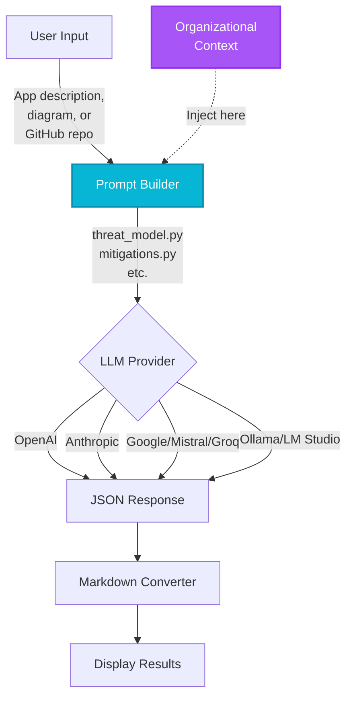
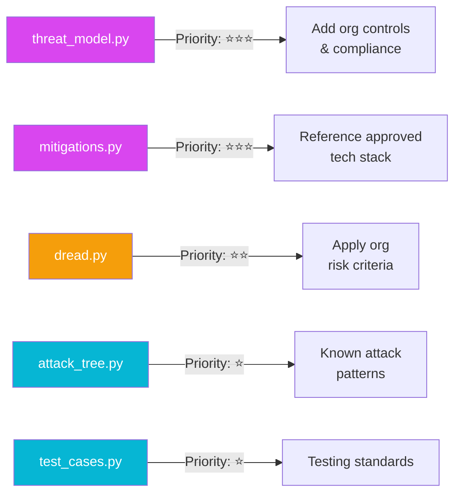
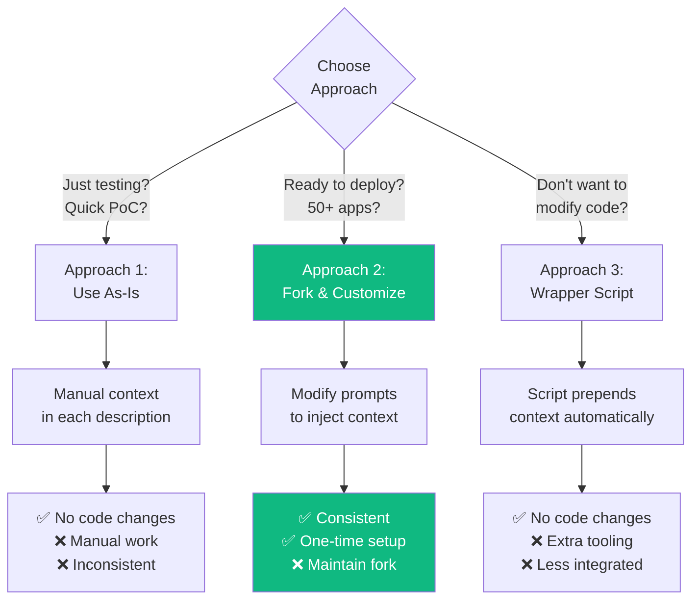
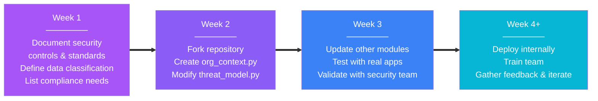
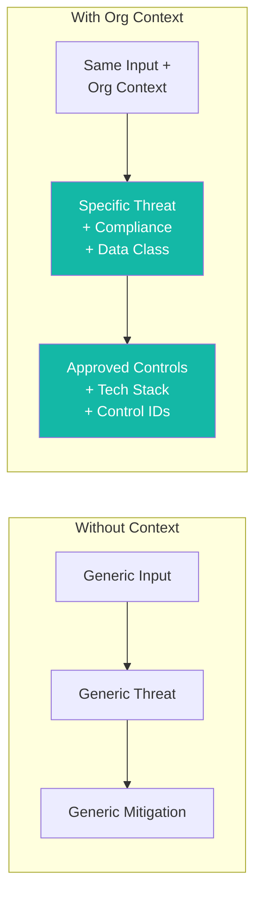
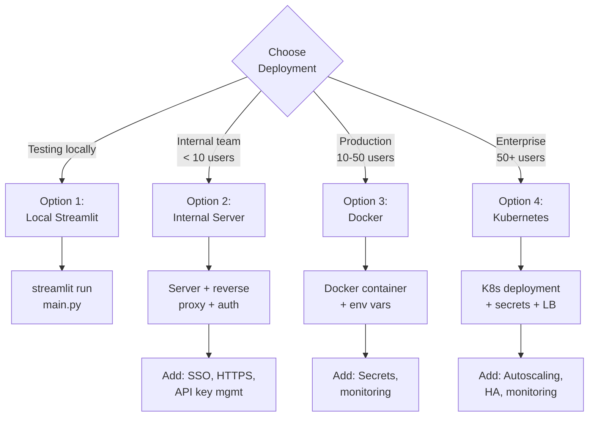
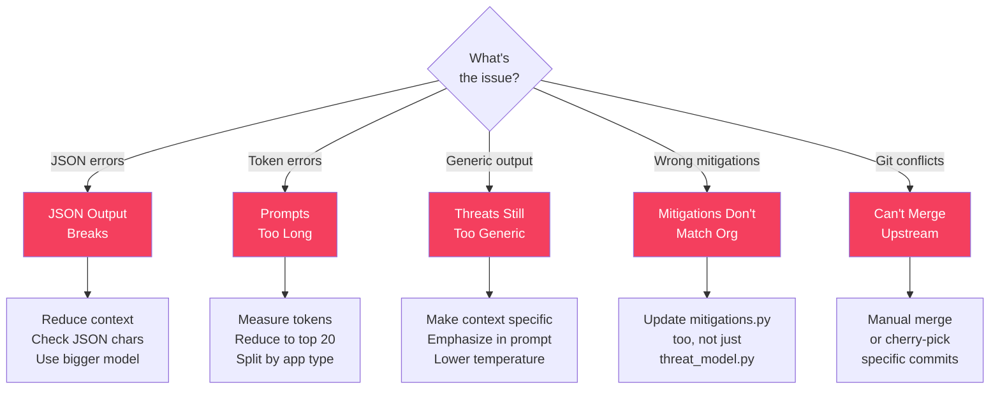

# Operationalizing STRIDE-GPT: A Practical Guide

## What This Guide Is About

STRIDE-GPT is a Streamlit application that generates threat models using LLMs. This guide shows you how to customize it for your organization to get better, more relevant threat models.

**Key insight**: The quality of threat models depends on the context you provide. Generic inputs → generic threats. Organizational context → specific, actionable threats.

---

## Understanding STRIDE-GPT's Architecture

### How STRIDE-GPT Works



**Customization Point:** The organizational context (purple box) needs to be injected into the Prompt Builder (blue box).

### Current Customization Points



### Key Limitation
**STRIDE-GPT doesn't currently have a built-in way to inject organizational context.** You need to modify the code yourself.

---

## Three Approaches to Using STRIDE-GPT



### Approach 1: Use As-Is (Quickest)
Manually add organizational context to your application descriptions.

**Example Input:**
```
Application: Customer portal web application

Architecture: Three-tier web app on AWS
- Frontend: React (hosted on CloudFront)
- Backend: Python FastAPI (ECS Fargate)
- Database: RDS PostgreSQL

Organizational Context:
- We use Okta SSO (all apps must use it)
- Data classification: PII (Customer names, emails)
- Compliance: SOC2 Type II required
- Approved controls: WAF (AWS WAF), encryption at rest (RDS encryption)
```

**Pros:** No code changes, works immediately
**Cons:** Manual work for each threat model, inconsistent context

### Approach 2: Fork and Customize (Recommended)
Modify the code to automatically inject your organizational context.

**Pros:** Consistent context, one-time setup, control over deployment
**Cons:** Requires code changes, ongoing maintenance to merge upstream updates

### Approach 3: Wrapper Script
Keep STRIDE-GPT as-is, build a wrapper that prepends context.

**Pros:** No STRIDE-GPT code changes, easier to update
**Cons:** Less integrated, requires separate tooling

---

## Quick Start: Fork and Customize

### Implementation Roadmap



### Prerequisites
- Basic Python knowledge
- Git installed
- Python 3.12+ installed

### Step 1: Fork the Repository
```bash
git clone https://github.com/mrwadams/stride-gpt.git my-org-stride-gpt
cd my-org-stride-gpt
```

### Step 2: Create Your Organizational Context

Create a new file `org_context.py` that contains:
- **Approved security controls** (authentication, encryption, network, monitoring)
- **Technology stack** (approved languages, frameworks, cloud platforms)
- **Compliance requirements** (SOC2, GDPR, PCI-DSS, etc.)
- **Data classification levels** (Public, Internal, Confidential, Restricted)
- **Standard architectures** (your typical web app, mobile app, API patterns)

**Important:** Start small. Add your top 10-20 controls, 1-2 architectures, and key compliance requirements. You can expand later.

<details>
<summary>Example: org_context.py structure (click to expand)</summary>

The file should define your security context as a text string including:
- Authentication requirements (e.g., "Okta SSO with MFA mandatory")
- Encryption standards (e.g., "AES-256 at rest, TLS 1.3 in transit")
- Approved tech stack (e.g., "Python 3.9+, React, PostgreSQL, AWS only")
- Compliance frameworks (e.g., "SOC2 Type II for all production")
- Reference architectures (e.g., "CloudFront → ALB → ECS → RDS")
</details>

### Step 3: Modify the Threat Model Prompt

Open `threat_model.py` and find the `create_threat_model_prompt` function (around line 33).

**Key changes needed:**
1. Import your organizational context: `from org_context import get_org_context`
2. Inject the context into the prompt before the main instructions
3. Add guidance to the LLM to reference your specific controls, tech stack, and compliance requirements

This ensures every threat model generated will be tailored to your organization's standards.

<details>
<summary>Technical implementation details (click to expand)</summary>

The modification involves adding your org context to the prompt template and instructing the LLM to:
- Reference approved security controls by name
- Only suggest mitigations using your approved tech stack
- Consider your specific compliance requirements
- Apply your data classification levels when assessing impact
- Flag technologies not in your approved stack
- Identify gaps where standard controls aren't implemented
</details>

### Step 4: Update Other Modules (Optional but Recommended)

Apply the same pattern to other modules:
- **`mitigations.py`** - Ensures suggested mitigations use your approved tech stack
- **`attack_tree.py`** - Incorporates known attack patterns from your environment
- **`dread.py`** - Applies your organization's risk scoring criteria
- **`test_cases.py`** - References your testing standards and frameworks

Each follows the same pattern: import the context, inject it into the prompt, and guide the LLM to use your organization's standards.

### Step 5: Test Your Changes

```bash
# Install dependencies (if not already done)
pip install -r requirements.txt

# Run locally
streamlit run main.py
```

**Test checklist:**
1. Generate a threat model for a test application
2. Verify threats reference your security controls
3. Verify mitigations suggest your approved technologies
4. Check that compliance requirements are mentioned
5. Confirm data classification levels are applied correctly
6. Ensure JSON output is still valid (not broken by context injection)

### Step 6: Handle Token Limits

Large organizational context can consume tokens. Best practices:
- **Monitor context size** - Keep organizational context under 10-20k tokens
- **Start focused** - Include only your top 20 controls and 2-3 reference architectures
- **Optimize over time** - Add more detail based on actual usage patterns
- **Conditional loading** - Load different context based on application type (web, mobile, API)

Modern LLMs (GPT-4o, Claude Sonnet 4.5) have 100k-200k token context windows, so most organizational contexts fit comfortably.

---

## Before/After Example

### Impact of Organizational Context



### Without Organizational Context

**Generated Threat:**
```
Threat Type: Information Disclosure
Scenario: Sensitive data could be exposed if the database is compromised
Potential Impact: Data breach exposing user information
```

**Generated Mitigation:**
```
- Implement database encryption
- Use access controls
- Enable audit logging
```

### With Organizational Context

**Generated Threat:**
```
Threat Type: Information Disclosure
Scenario: Customer PII (Confidential data classification) in RDS PostgreSQL could be exposed if database encryption at rest is not enabled, violating SOC2 CC6.6 requirements
Potential Impact: Data breach exposing Confidential customer data, SOC2 compliance violation, potential GDPR Article 32 breach for EU customers
```

**Generated Mitigation:**
```
- Enable RDS encryption at rest using AWS KMS (approved control: Data-001)
- Verify VPC isolation is configured per standard architecture (no direct internet access)
- Implement database access logging to CloudWatch (approved monitoring: Monitor-001)
- Ensure Okta SSO authentication is enforced for database admin access (approved control: Auth-001)
```

**Key improvements:**
- ✅ Specific data classification referenced
- ✅ Compliance frameworks cited
- ✅ Approved controls referenced by ID/name
- ✅ Matches organizational architecture standards

---

## Deployment Options



### Option 1: Run Locally
```bash
streamlit run main.py --server.port 8501
```

### Option 2: Internal Server Deployment
```bash
# On your internal server
streamlit run main.py --server.port 8501 --server.address 0.0.0.0
```

**Security considerations:**
- Put behind authentication (SSO, VPN)
- Use HTTPS (reverse proxy with nginx/Apache)
- Store API keys in environment variables, not in code

### Option 3: Docker Deployment

The project includes a Dockerfile. Build your customized version:

```bash
docker build -t myorg-stride-gpt .
```

**Local development/testing:**
```bash
# Use .env file for local testing only
docker run -p 8501:8501 --env-file .env myorg-stride-gpt
```

**Production deployment:**

⚠️ **Never use `.env` files in production.** Use proper secrets management:

**Option A: Docker Swarm Secrets**
```bash
echo "sk-..." | docker secret create openai_api_key -
docker service create \
  --secret openai_api_key \
  --publish 8501:8501 \
  myorg-stride-gpt
```

**Option B: Environment variables from secure source**
```bash
# Pass from AWS Secrets Manager, HashiCorp Vault, etc.
docker run -p 8501:8501 \
  -e OPENAI_API_KEY=$(aws secretsmanager get-secret-value --secret-id prod/stride-gpt/openai --query SecretString --output text) \
  myorg-stride-gpt
```

**API Keys needed:**
- LLM provider keys (OpenAI, Anthropic, Google, etc.)
- Optional: GitHub token for repository analysis
- Optional: Ollama/LM Studio endpoints for local models

### Option 4: Kubernetes (Enterprise)

For organizations running Kubernetes:
- Deploy as a standard containerized application
- Store API keys as Kubernetes secrets
- Configure resource limits (typically 512Mi-1Gi memory)
- Use load balancer for high availability
- Enable autoscaling based on usage

Your DevOps team can use standard Kubernetes deployment patterns with the STRIDE-GPT Docker image.

---

## Maintenance and Updates

### Keeping Up with Upstream Changes

```bash
# Add upstream remote (one time)
git remote add upstream https://github.com/mrwadams/stride-gpt.git

# Fetch latest changes
git fetch upstream

# View what changed
git log HEAD..upstream/main --oneline

# Merge updates (be careful - may conflict with your modifications)
git merge upstream/main
```

**When conflicts occur:**
- Your `org_context.py` won't conflict (it's new)
- Prompt modifications in `threat_model.py` etc. will likely conflict
- Manually resolve by preserving both upstream improvements and your org context injection

### Version Control Your Organizational Context

Treat your `org_context.py` like any other critical configuration:
- Include version numbers and last updated dates
- Maintain a changelog of what controls were added/modified
- Review and update quarterly
- Track who made changes and why

### Regular Updates to Consider

**Quarterly:**
- Review and update security controls
- Add newly approved technologies
- Update compliance requirements
- Incorporate lessons learned from threat models

**When needed:**
- After security incidents (add new threat patterns)
- When new compliance requirements emerge
- After technology stack changes
- When new reference architectures are approved

---

## Troubleshooting



### Problem: JSON Output Breaks After Adding Context

**Symptom:** Error parsing JSON response from LLM

**Cause:** Context too large, confusing the model, or breaking token limits

**Solutions:**
1. Reduce context size - keep only essential information
2. Use a model with larger context window (GPT-4, Claude Opus)
3. Test with simpler app descriptions first
4. Check that your context doesn't include unescaped JSON characters

### Problem: Prompts Too Long / Token Limit Errors

**Symptom:** API errors about token limits

**Solutions:**
1. Measure your context size using token counting tools
2. If too large (>10k tokens for context alone):
   - Reduce to top 20 controls
   - Remove verbose descriptions
   - Use abbreviations
   - Split into conditional loading based on app type

### Problem: Threats Still Too Generic

**Symptom:** Organizational context doesn't seem to affect outputs

**Causes & Solutions:**
1. **Context not in the right place in prompt:**
   - Make sure it's before the IMPORTANT instructions
   - Emphasize in the instructions to use the context

2. **Context too vague:**
   - Be specific: "Okta SSO with MFA" not "SSO"
   - Include implementation details
   - Provide exact technology versions

3. **Model temperature too high:**
   - In the get_threat_model() calls, reduce temperature to 0.3-0.5

### Problem: Mitigations Don't Match Org Controls

**Symptom:** Suggested mitigations ignore organizational standards

**Cause:** Only updated `threat_model.py`, not `mitigations.py`

**Solution:** Update the `create_mitigations_prompt` function in `mitigations.py` to also inject organizational context (see Step 4 above)

### Problem: Can't Merge Upstream Updates

**Symptom:** Git conflicts in modified files

**Solution:**
```bash
# Option 1: Manual merge
git merge upstream/main
# Fix conflicts in threat_model.py, mitigations.py, etc.
# Keep both upstream improvements and your org context injection
git add .
git commit -m "Merged upstream updates, preserved org customizations"

# Option 2: Cherry-pick specific updates
git log upstream/main --oneline
git cherry-pick <commit-hash>  # Pick specific improvements
```

---

## Common Customizations

### 1. Environment-Based Context Loading
Load different security contexts for dev/staging/prod environments. Production requires all controls, while development can have relaxed requirements for testing.

### 2. Application Type-Specific Context
Customize context based on application type (web, mobile, API). Each type has specific security controls relevant to it (e.g., WAF for web apps, certificate pinning for mobile).

### 3. Conditional Loading
Load only relevant portions of your context based on application characteristics to manage token usage efficiently.

---

## Measuring Success

Consider tracking:

| Metric | How to Measure |
|--------|---------------|
| **Threat model quality** | % of threats validated by security team as accurate |
| **Time savings** | Time to generate model vs. manual process |
| **Adoption** | Number of threat models generated per month |
| **Coverage** | % of applications with threat models |
| **Context effectiveness** | % of threats that reference org controls |

### Simple Usage Tracking

Consider adding basic logging to track:
- Number of threat models generated per month
- Which LLM providers are being used
- Average threats identified per model
- Which teams/applications are using the tool

This data helps demonstrate ROI and identify opportunities for improvement.

---

## Alternative: Wrapper Script Approach

If you don't want to modify STRIDE-GPT code, you can create a simple script that:
1. Takes your application description as input
2. Automatically prepends your organizational context
3. Outputs the combined text to paste into STRIDE-GPT

**Pros:** No STRIDE-GPT code changes, easier to maintain
**Cons:** Manual copy-paste step, not integrated into the UI

This is useful for quick pilots or when you can't deploy a modified version.

---

## Next Steps

### Week 1: Prepare Your Context
1. Document your top 10-20 security controls
2. Identify 1-2 standard reference architectures
3. List compliance requirements (SOC2, GDPR, etc.)
4. Define your data classification scheme
5. Create `org_context.py` with this information

### Week 2: Implement and Test
1. Fork the STRIDE-GPT repository
2. Add organizational context injection to `threat_model.py`
3. Test with 3-5 real applications from your organization
4. Compare outputs with and without context
5. Validate threats with your security team

### Week 3: Expand and Deploy
1. Update `mitigations.py`, `dread.py`, and other modules
2. Set up internal deployment (Docker/K8s)
3. Configure authentication and API key management
4. Create user documentation for your team

### Week 4+: Scale and Iterate
1. Train security champions on the tool
2. Gather feedback on threat model quality
3. Refine organizational context based on learnings
4. Consider CI/CD integration for automated threat modeling
5. Track metrics and measure impact

---

## FAQs

### Q: Can I use this with local/private LLMs?
**A:** Yes! STRIDE-GPT supports Ollama and LM Studio for on-premises deployment. This is useful for organizations with data privacy requirements. Set up Ollama locally, load a model (e.g., `ollama pull llama2`), and select "Ollama" as the provider in the UI.

### Q: How much context is too much?
**A:** Monitor token usage. Current model context windows (2025):
- **GPT-5**: 272k input tokens (400k total)
- **Claude Sonnet 4.5**: 200k tokens (1M with extended context)
- **GPT-4o**: 128k tokens
- Local models (Ollama/LM Studio): Typically 4-32k tokens

For organizational context, aim for 10-20k tokens (20-30 controls + 2-3 architectures). This leaves room for application descriptions and responses while staying well within modern model limits.

### Q: Should I use RAG to store organizational docs?
**A:** Probably not necessary. Modern LLMs have 100k-200k token context windows. For most organizations, your security controls, architectures, and compliance requirements fit comfortably in 5-10k tokens. Just include them directly in the prompt. RAG adds complexity without clear benefits for this use case.

### Q: How do I keep my fork synchronized with upstream?
**A:**
```bash
git remote add upstream https://github.com/mrwadams/stride-gpt.git
git fetch upstream
git merge upstream/main
```
Be careful with merge conflicts in files you've modified (`threat_model.py`, etc.). Manually resolve to keep both upstream improvements and your customizations.

### Q: Will this work with reasoning models (OpenAI o1, etc.)?
**A:** Yes, STRIDE-GPT supports reasoning models. They already handle context well, so organizational context injection works the same way. Note that reasoning models use more tokens, so monitor your context size.

### Q: Can I automate threat model generation in CI/CD?
**A:** STRIDE-GPT is built as an interactive Streamlit app, not a CLI tool. However, you can extract the core functions to create an automated wrapper for CI/CD pipelines. This allows you to generate threat models automatically when code changes or during release processes.

### Q: What if my organization uses GitHub Enterprise?
**A:** STRIDE-GPT already supports GitHub Enterprise (added in v0.14). Just provide your GitHub Enterprise URL and it will automatically detect and use the correct API endpoint.

### Q: How do I handle multiple compliance frameworks?
**A:** Include all applicable frameworks in your organizational context. You can conditionally load specific requirements based on the application's data classification or type. For example, GDPR applies when handling EU customer data, PCI-DSS for payment processing, HIPAA for healthcare data, etc.

---

## Resources

- **STRIDE-GPT Repository:** https://github.com/mrwadams/stride-gpt
- **Issues & Questions:** [GitHub Issues](https://github.com/mrwadams/stride-gpt/issues)
- **Docker Image:** `mrwadams/stridegpt:latest`
- **Documentation:** See the README for general usage

## Contributing Back

If you develop useful organizational patterns or improvements:

1. **Share anonymized patterns** - Open an issue describing your approach (without sensitive details)
2. **Contribute code** - Submit PRs for general improvements
3. **Help others** - Answer questions in GitHub Discussions
4. **Document lessons learned** - Share what worked and what didn't

Example contribution:
```
Title: Pattern for multi-environment context loading

Description: We implemented environment-specific context (dev/staging/prod)
using environment variables. Code pattern attached. Helped us maintain different
control requirements across environments while using the same codebase.

Benefits:
- Single codebase for all environments
- Easy context switching via env vars
- Reduced false positives in dev/staging

[Code example...]
```

---

## Conclusion

Operationalizing STRIDE-GPT for your organization primarily involves:

1. **Creating organizational context** - Document your controls, architectures, compliance requirements
2. **Injecting context into prompts** - Modify `threat_model.py` and other modules
3. **Deploying internally** - Docker/Kubernetes with proper security controls
4. **Iterating based on feedback** - Refine context as you learn what works

Start small, test thoroughly, and expand based on results. The goal is threat models that are specific to your environment, reference your controls, and provide actionable guidance to your development teams.
