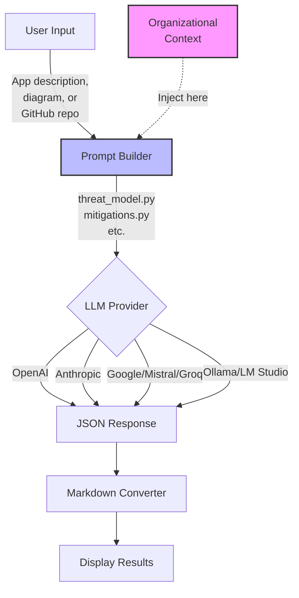
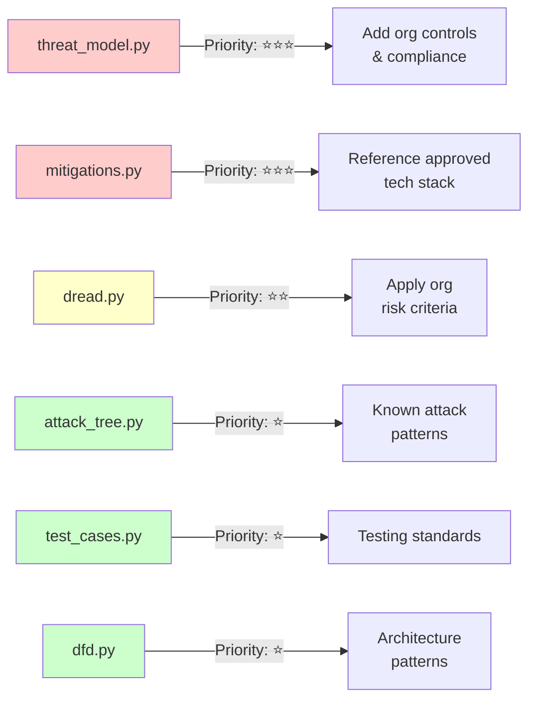
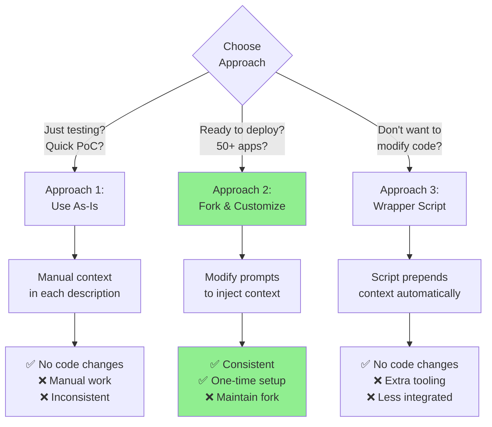
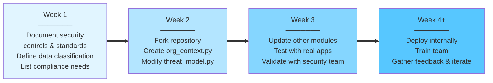
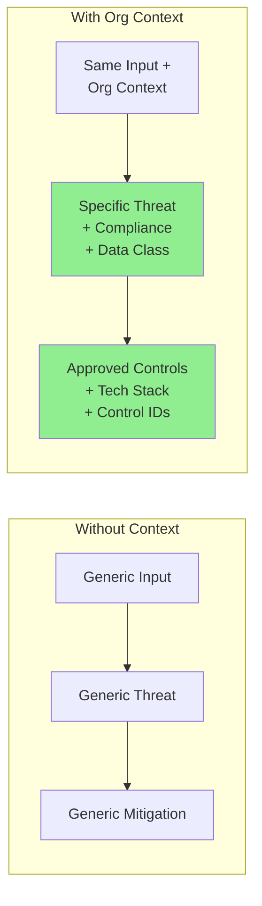
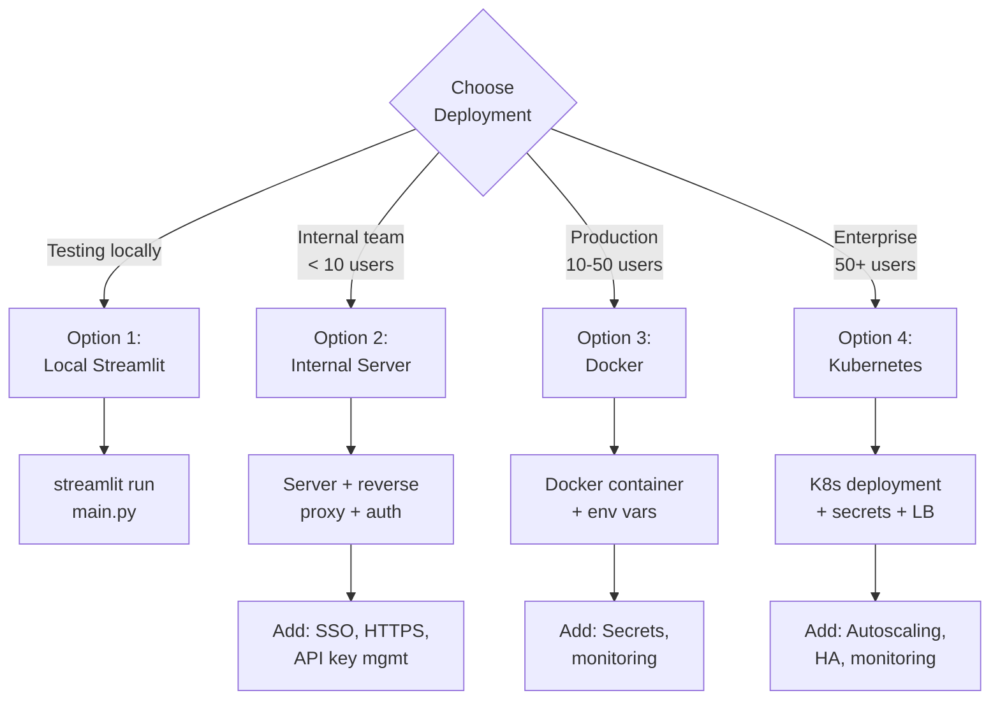
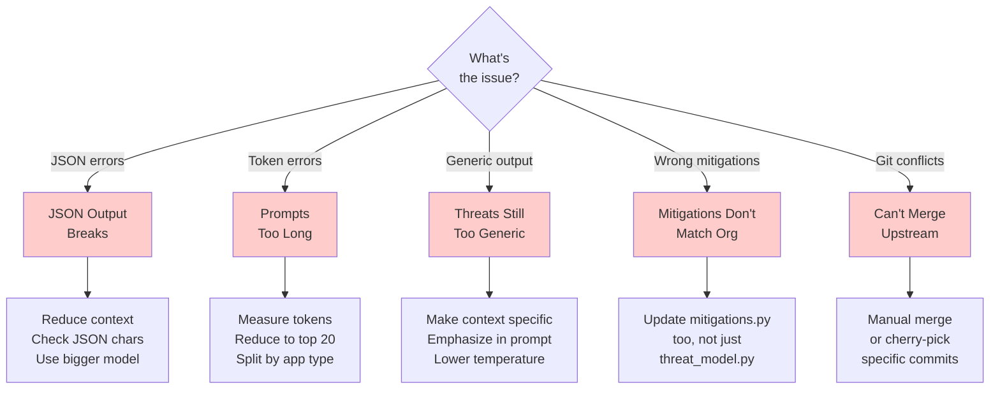

# Operationalizing STRIDE-GPT: A Practical Guide

## What This Guide Is About

STRIDE-GPT is a Streamlit application that generates threat models using LLMs. This guide shows you how to customize it for your organization to get better, more relevant threat models.

**The key insight**: The quality of threat models depends on the context you provide. Generic inputs → generic threats. Organizational context → specific, actionable threats.

---

## Understanding STRIDE-GPT's Architecture

### How STRIDE-GPT Works



**Customization Point:** The organizational context (pink box) needs to be injected into the Prompt Builder (blue box).

### Current Customization Points



### Key Limitation
**STRIDE-GPT doesn't currently have a built-in way to inject organizational context.** You need to modify the code yourself.

---

## Three Approaches to Using STRIDE-GPT



### Approach 1: Use As-Is (Quickest)
Manually add organizational context to your application descriptions.

**Example Input:**
```
Application: Customer portal web application

Architecture: Three-tier web app on AWS
- Frontend: React (hosted on CloudFront)
- Backend: Python FastAPI (ECS Fargate)
- Database: RDS PostgreSQL

Organizational Context:
- We use Okta SSO (all apps must use it)
- Data classification: PII (Customer names, emails)
- Compliance: SOC2 Type II required
- Approved controls: WAF (AWS WAF), encryption at rest (RDS encryption)
```

**Pros:** No code changes, works immediately
**Cons:** Manual work for each threat model, inconsistent context

### Approach 2: Fork and Customize (Recommended)
Modify the code to automatically inject your organizational context.

**Pros:** Consistent context, one-time setup, control over deployment
**Cons:** Requires code changes, ongoing maintenance to merge upstream updates

### Approach 3: Wrapper Script
Keep STRIDE-GPT as-is, build a wrapper that prepends context.

**Pros:** No STRIDE-GPT code changes, easier to update
**Cons:** Less integrated, requires separate tooling

---

## Quick Start: Fork and Customize

### Implementation Roadmap



### Prerequisites
- Basic Python knowledge
- Git installed
- Python 3.9+ installed

### Step 1: Fork the Repository
```bash
git clone https://github.com/mrwadams/stride-gpt.git my-org-stride-gpt
cd my-org-stride-gpt
```

### Step 2: Create Your Organizational Context

Create a new file `org_context.py` in the root directory:

```python
# org_context.py

ORG_CONTEXT = """
# [Your Organization] Security Context

## Approved Security Controls
- Authentication: Okta SSO with MFA (mandatory for all production apps)
- Data Encryption: AES-256 at rest, TLS 1.3 in transit
- Network: VPC with private subnets, no direct internet access to databases
- Monitoring: CloudWatch + Datadog for all production systems

## Approved Technology Stack
### Allowed:
- Languages: Python 3.9+, Node.js 18+, Java 17+
- Frontend: React, Vue.js
- Backend: FastAPI, Express.js, Spring Boot
- Databases: PostgreSQL, MongoDB
- Cloud: AWS only (us-east-1, eu-west-1)

### Prohibited:
- Deprecated protocols: FTP, Telnet
- Weak cryptography: MD5, SHA1, DES

## Compliance Requirements
- SOC2 Type II (all production systems)
- GDPR (EU customer data)
- PCI-DSS (payment processing apps only)

## Data Classification Levels
- **Public**: Marketing content, public documentation
- **Internal**: Internal processes, organizational charts
- **Confidential**: Customer PII, financial data
- **Restricted**: Payment card data, health records

## Standard Reference Architecture (Web Applications)
- CloudFront (CDN) → ALB → ECS Fargate → RDS PostgreSQL
- Security: WAF, API Gateway rate limiting, VPC isolation
- Monitoring: CloudWatch Logs, X-Ray tracing
"""

def get_org_context():
    """Return organizational security context for threat modeling"""
    return ORG_CONTEXT
```

**Important:** Start small. Add your top 10-20 controls, 1-2 architectures, and key compliance requirements. You can expand later.

### Step 3: Modify the Threat Model Prompt

Open `threat_model.py` and find the `create_threat_model_prompt` function (around line 33).

**Add the import at the top of the file:**
```python
from org_context import get_org_context
```

**Modify the function to inject organizational context:**

```python
def create_threat_model_prompt(app_type, authentication, internet_facing, sensitive_data, app_input):
    # Get organizational context
    org_context = get_org_context()

    prompt = f"""
Act as a cyber security expert with more than 20 years experience of using the STRIDE threat modelling methodology to produce comprehensive threat models for a wide range of applications. Your task is to analyze the provided code summary, README content, and application description to produce a list of specific threats for the application.

Pay special attention to the README content as it often provides valuable context about the project's purpose, architecture, and potential security considerations.

ORGANIZATIONAL SECURITY CONTEXT:
{org_context}

IMPORTANT: When generating threats and mitigations:
1. Reference our approved security controls by name when they apply
2. Only suggest mitigations using our approved technology stack
3. Consider our compliance requirements (SOC2, GDPR, PCI-DSS as applicable)
4. Apply our data classification levels when assessing impact severity
5. Flag any technologies not in our approved stack as potential risks
6. Identify gaps where our standard controls are not implemented

For each of the STRIDE categories (Spoofing, Tampering, Repudiation, Information Disclosure, Denial of Service, and Elevation of Privilege), list multiple (3 or 4) credible threats if applicable. Each threat scenario should provide a credible scenario in which the threat could occur in the context of the application. It is very important that your responses are tailored to reflect the details you are given.

When providing the threat model, use a JSON formatted response with the keys "threat_model" and "improvement_suggestions". Under "threat_model", include an array of objects with the keys "Threat Type", "Scenario", and "Potential Impact".

Under "improvement_suggestions", include an array of strings that suggest what additional information or details the user could provide to make the threat model more comprehensive and accurate in the next iteration. Focus on identifying gaps in the provided application description that, if filled, would enable a more detailed and precise threat analysis. For example:
- Missing architectural details that would help identify more specific threats
- Unclear authentication flows that need more detail
- Incomplete data flow descriptions
- Missing technical stack information
- Unclear system boundaries or trust zones
- Incomplete description of sensitive data handling

Do not provide general security recommendations - focus only on what additional information would help create a better threat model.

APPLICATION TYPE: {app_type}
AUTHENTICATION METHODS: {authentication}
INTERNET FACING: {internet_facing}
SENSITIVE DATA: {sensitive_data}
CODE SUMMARY, README CONTENT, AND APPLICATION DESCRIPTION:
{app_input}

Example of expected JSON response format:

    {{
      "threat_model": [
        {{
          "Threat Type": "Spoofing",
          "Scenario": "An attacker could impersonate a legitimate user by stealing session tokens transmitted over an unencrypted connection.",
          "Potential Impact": "Unauthorized access to user accounts and sensitive data."
        }}
      ],
      "improvement_suggestions": [
        "Provide details about the authentication mechanism used (e.g., OAuth, SAML, JWT).",
        "Clarify where and how session tokens are stored and transmitted.",
        "Specify which data classification levels are handled by this application."
      ]
    }}
"""
    return prompt
```

**Note:** This preserves the original prompt structure while injecting your organizational context.

### Step 4: Update Other Modules (Optional but Recommended)

You should also update the other modules to use organizational context:

**For `mitigations.py`**, find `create_mitigations_prompt` and add:
```python
from org_context import get_org_context

def create_mitigations_prompt(threats):
    org_context = get_org_context()

    prompt = f"""
Act as a cyber security expert...

ORGANIZATIONAL CONTEXT:
{org_context}

IMPORTANT: Suggest mitigations using only our approved technology stack and security controls.

THREAT MODEL:
{threats}
...
"""
```

**Repeat for:**
- `attack_tree.py` - Add context about known attack patterns in your environment
- `dread.py` - Add context about your risk scoring criteria
- `test_cases.py` - Add context about your testing standards

### Step 5: Test Your Changes

```bash
# Install dependencies (if not already done)
pip install -r requirements.txt

# Run locally
streamlit run main.py
```

**Test checklist:**
1. Generate a threat model for a test application
2. Verify threats reference your security controls
3. Verify mitigations suggest your approved technologies
4. Check that compliance requirements are mentioned
5. Confirm data classification levels are applied correctly
6. Ensure JSON output is still valid (not broken by context injection)

### Step 6: Handle Token Limits

Large organizational context can consume tokens. Monitor this:

**Add token counting (optional):**
```python
import tiktoken

def estimate_tokens(text, model="gpt-4"):
    encoding = tiktoken.encoding_for_model(model)
    return len(encoding.encode(text))

# Before sending to LLM
org_context = get_org_context()
context_tokens = estimate_tokens(org_context)
print(f"Organizational context uses ~{context_tokens} tokens")
```

**If context is too large:**
- Reduce to essential controls only
- Split into multiple context functions (get_controls(), get_compliance(), etc.)
- Load context conditionally based on app type

---

## Before/After Example

### Impact of Organizational Context



### Without Organizational Context

**Generated Threat:**
```
Threat Type: Information Disclosure
Scenario: Sensitive data could be exposed if the database is compromised
Potential Impact: Data breach exposing user information
```

**Generated Mitigation:**
```
- Implement database encryption
- Use access controls
- Enable audit logging
```

### With Organizational Context

**Generated Threat:**
```
Threat Type: Information Disclosure
Scenario: Customer PII (Confidential data classification) in RDS PostgreSQL could be exposed if database encryption at rest is not enabled, violating SOC2 CC6.6 requirements
Potential Impact: Data breach exposing Confidential customer data, SOC2 compliance violation, potential GDPR Article 32 breach for EU customers
```

**Generated Mitigation:**
```
- Enable RDS encryption at rest using AWS KMS (approved control: Data-001)
- Verify VPC isolation is configured per standard architecture (no direct internet access)
- Implement database access logging to CloudWatch (approved monitoring: Monitor-001)
- Ensure Okta SSO authentication is enforced for database admin access (approved control: Auth-001)
```

**Key improvements:**
- ✅ Specific data classification referenced
- ✅ Compliance frameworks cited
- ✅ Approved controls referenced by ID/name
- ✅ Matches organizational architecture standards

---

## Deployment Options



### Option 1: Run Locally
```bash
streamlit run main.py --server.port 8501
```

### Option 2: Internal Server Deployment
```bash
# On your internal server
streamlit run main.py --server.port 8501 --server.address 0.0.0.0
```

**Security considerations:**
- Put behind authentication (SSO, VPN)
- Use HTTPS (reverse proxy with nginx/Apache)
- Store API keys in environment variables, not in code

### Option 3: Docker Deployment

The project already includes a Dockerfile. Build your customized version:

```bash
# Build custom image
docker build -t myorg-stride-gpt .

# Run with environment file
docker run -p 8501:8501 --env-file .env myorg-stride-gpt
```

**Update `.env` file for production:**
```bash
# Required API keys
OPENAI_API_KEY=sk-...
ANTHROPIC_API_KEY=sk-ant-...

# Optional (based on your model provider choice)
AZURE_API_KEY=...
GOOGLE_API_KEY=...
MISTRAL_API_KEY=...
GROQ_API_KEY=...

# For on-premises models
OLLAMA_ENDPOINT=http://ollama-server:11434
LM_STUDIO_ENDPOINT=http://lm-studio-server:1234

# Optional: GitHub for repo analysis
GITHUB_API_KEY=ghp_...
```

**Docker secrets management:**
```bash
# Use Docker secrets instead of .env for production
echo "sk-..." | docker secret create openai_api_key -
docker service create --secret openai_api_key myorg-stride-gpt
```

### Option 4: Kubernetes (Enterprise)

```yaml
# deployment.yaml
apiVersion: apps/v1
kind: Deployment
metadata:
  name: stride-gpt
  namespace: security-tools
spec:
  replicas: 2
  selector:
    matchLabels:
      app: stride-gpt
  template:
    metadata:
      labels:
        app: stride-gpt
    spec:
      containers:
      - name: stride-gpt
        image: myorg/stride-gpt:latest
        ports:
        - containerPort: 8501
        env:
        - name: OPENAI_API_KEY
          valueFrom:
            secretKeyRef:
              name: stride-gpt-secrets
              key: openai-api-key
        resources:
          requests:
            memory: "512Mi"
            cpu: "500m"
          limits:
            memory: "1Gi"
            cpu: "1000m"
---
apiVersion: v1
kind: Service
metadata:
  name: stride-gpt-service
  namespace: security-tools
spec:
  selector:
    app: stride-gpt
  ports:
  - port: 80
    targetPort: 8501
  type: LoadBalancer
```

**Create secrets:**
```bash
kubectl create secret generic stride-gpt-secrets \
  --from-literal=openai-api-key=sk-... \
  --namespace=security-tools
```

---

## Maintenance and Updates

### Keeping Up with Upstream Changes

```bash
# Add upstream remote (one time)
git remote add upstream https://github.com/mrwadams/stride-gpt.git

# Fetch latest changes
git fetch upstream

# View what changed
git log HEAD..upstream/main --oneline

# Merge updates (be careful - may conflict with your modifications)
git merge upstream/main
```

**When conflicts occur:**
- Your `org_context.py` won't conflict (it's new)
- Prompt modifications in `threat_model.py` etc. will likely conflict
- Manually resolve by preserving both upstream improvements and your org context injection

### Version Control Your Organizational Context

```python
# org_context.py
ORG_CONTEXT_VERSION = "1.0.0"
LAST_UPDATED = "2024-01-15"
UPDATED_BY = "security-team@myorg.com"

ORG_CONTEXT = f"""
# MyOrg Security Context v{ORG_CONTEXT_VERSION}
Last Updated: {LAST_UPDATED}

## Change Log
- v1.0.0 (2024-01-15): Initial organizational context
  - Added 20 core security controls
  - Documented standard web application architecture
  - Defined data classification levels

...rest of context...
"""
```

### Regular Updates to Consider

**Quarterly:**
- Review and update security controls
- Add newly approved technologies
- Update compliance requirements
- Incorporate lessons learned from threat models

**When needed:**
- After security incidents (add new threat patterns)
- When new compliance requirements emerge
- After technology stack changes
- When new reference architectures are approved

---

## Troubleshooting



### Problem: JSON Output Breaks After Adding Context

**Symptom:** Error parsing JSON response from LLM

**Cause:** Context too large, confusing the model, or breaking token limits

**Solutions:**
1. Reduce context size - keep only essential information
2. Use a model with larger context window (GPT-4, Claude Opus)
3. Test with simpler app descriptions first
4. Check that your context doesn't include unescaped JSON characters

### Problem: Prompts Too Long / Token Limit Errors

**Symptom:** API errors about token limits

**Solutions:**
1. Measure your context size:
```python
from org_context import get_org_context
import tiktoken

encoding = tiktoken.encoding_for_model("gpt-4")
tokens = len(encoding.encode(get_org_context()))
print(f"Context uses {tokens} tokens")
```

2. If too large (>10k tokens for context alone):
   - Reduce to top 20 controls
   - Remove verbose descriptions
   - Use abbreviations
   - Split into conditional loading based on app type

### Problem: Threats Still Too Generic

**Symptom:** Organizational context doesn't seem to affect outputs

**Causes & Solutions:**
1. **Context not in the right place in prompt:**
   - Make sure it's before the IMPORTANT instructions
   - Emphasize in the instructions to use the context

2. **Context too vague:**
   - Be specific: "Okta SSO with MFA" not "SSO"
   - Include implementation details
   - Provide exact technology versions

3. **Model temperature too high:**
   - In the get_threat_model() calls, reduce temperature to 0.3-0.5

### Problem: Mitigations Don't Match Org Controls

**Symptom:** Suggested mitigations ignore organizational standards

**Cause:** Only updated `threat_model.py`, not `mitigations.py`

**Solution:** Update the `create_mitigations_prompt` function in `mitigations.py` to also inject organizational context (see Step 4 above)

### Problem: Can't Merge Upstream Updates

**Symptom:** Git conflicts in modified files

**Solution:**
```bash
# Option 1: Manual merge
git merge upstream/main
# Fix conflicts in threat_model.py, mitigations.py, etc.
# Keep both upstream improvements and your org context injection
git add .
git commit -m "Merged upstream updates, preserved org customizations"

# Option 2: Cherry-pick specific updates
git log upstream/main --oneline
git cherry-pick <commit-hash>  # Pick specific improvements
```

---

## Common Customizations

### 1. Environment-Based Context Loading

Load different context for dev/staging/prod:

```python
# org_context.py
import os

def get_org_context():
    env = os.getenv('ENVIRONMENT', 'production')

    if env == 'production':
        return PROD_CONTEXT
    elif env == 'staging':
        return STAGING_CONTEXT
    else:
        return DEV_CONTEXT

PROD_CONTEXT = """
# Production Security Context
- All controls mandatory
- SOC2 compliance required
...
"""

DEV_CONTEXT = """
# Development Security Context
- Relaxed controls for testing
- Focus on secure coding practices
...
"""
```

### 2. Application Type-Specific Context

```python
# org_context.py
def get_org_context(app_type=None):
    base_context = get_base_context()

    if app_type == 'web':
        return base_context + WEB_APP_CONTEXT
    elif app_type == 'api':
        return base_context + API_CONTEXT
    elif app_type == 'mobile':
        return base_context + MOBILE_CONTEXT
    else:
        return base_context

WEB_APP_CONTEXT = """
## Web Application Specific Controls
- CloudFront CDN required
- WAF mandatory
- CORS policies defined
...
"""
```

Then in `threat_model.py`:
```python
org_context = get_org_context(app_type=app_type)
```

### 3. Use Environment Variables for Context

Instead of hardcoding, load from environment:

```python
# org_context.py
import os

def get_org_context():
    return os.getenv('ORG_SECURITY_CONTEXT', DEFAULT_CONTEXT)
```

Then set in `.env`:
```bash
ORG_SECURITY_CONTEXT="# MyOrg Context\n## Controls\n- Auth: Okta SSO..."
```

---

## Measuring Success

Consider tracking:

| Metric | How to Measure |
|--------|---------------|
| **Threat model quality** | % of threats validated by security team as accurate |
| **Time savings** | Time to generate model vs. manual process |
| **Adoption** | Number of threat models generated per month |
| **Coverage** | % of applications with threat models |
| **Context effectiveness** | % of threats that reference org controls |

### Simple Usage Tracking

Add basic analytics to understand usage:

```python
# analytics.py
import json
from datetime import datetime
import os

def log_threat_model(app_name, model_provider, threat_count, org_context_used=True):
    """Log threat model generation for tracking"""

    log_entry = {
        'timestamp': datetime.now().isoformat(),
        'app_name': app_name,
        'provider': model_provider,
        'threat_count': threat_count,
        'org_context_used': org_context_used
    }

    log_file = os.getenv('ANALYTICS_LOG', 'usage_log.jsonl')

    with open(log_file, 'a') as f:
        f.write(json.dumps(log_entry) + '\n')
```

Add to `threat_model.py`:
```python
from analytics import log_threat_model

# After generating threat model
log_threat_model(
    app_name=app_input[:50],  # First 50 chars as identifier
    model_provider=model_name,
    threat_count=len(threat_model.get('threat_model', []))
)
```

Analyze logs:
```bash
# Count threat models generated
cat usage_log.jsonl | wc -l

# Most used provider
cat usage_log.jsonl | jq -r '.provider' | sort | uniq -c | sort -rn

# Average threats per model
cat usage_log.jsonl | jq '.threat_count' | awk '{sum+=$1; count++} END {print sum/count}'
```

---

## Alternative: Wrapper Script Approach

If you don't want to modify STRIDE-GPT code, create a wrapper:

```python
#!/usr/bin/env python3
# threat_model_wrapper.py

import sys
from org_context import get_org_context

def prepare_enhanced_input(app_description):
    """Prepend organizational context to app description"""
    org_context = get_org_context()

    enhanced_input = f"""
{org_context}

---

APPLICATION TO ANALYZE:
{app_description}
"""
    return enhanced_input

if __name__ == "__main__":
    if len(sys.argv) < 2:
        print("Usage: ./threat_model_wrapper.py <app_description_file>")
        sys.exit(1)

    with open(sys.argv[1], 'r') as f:
        app_description = f.read()

    enhanced = prepare_enhanced_input(app_description)

    # Write to temp file
    with open('enhanced_input.txt', 'w') as f:
        f.write(enhanced)

    print("Enhanced input written to enhanced_input.txt")
    print("Copy this into STRIDE-GPT's application description field")
```

**Pros:** No STRIDE-GPT code changes
**Cons:** Manual copy-paste step, not integrated into UI

---

## Next Steps

### Week 1: Prepare Your Context
1. Document your top 10-20 security controls
2. Identify 1-2 standard reference architectures
3. List compliance requirements (SOC2, GDPR, etc.)
4. Define your data classification scheme
5. Create `org_context.py` with this information

### Week 2: Implement and Test
1. Fork the STRIDE-GPT repository
2. Add organizational context injection to `threat_model.py`
3. Test with 3-5 real applications from your organization
4. Compare outputs with and without context
5. Validate threats with your security team

### Week 3: Expand and Deploy
1. Update `mitigations.py`, `dread.py`, and other modules
2. Set up internal deployment (Docker/K8s)
3. Configure authentication and API key management
4. Create user documentation for your team

### Week 4+: Scale and Iterate
1. Train security champions on the tool
2. Gather feedback on threat model quality
3. Refine organizational context based on learnings
4. Consider CI/CD integration for automated threat modeling
5. Track metrics and measure impact

---

## FAQs

### Q: Can I use this with local/private LLMs?
**A:** Yes! STRIDE-GPT supports Ollama and LM Studio for on-premises deployment. This is useful for organizations with data privacy requirements. Set up Ollama locally, load a model (e.g., `ollama pull llama2`), and select "Ollama" as the provider in the UI.

### Q: How much context is too much?
**A:** Monitor token usage. Current model context windows (2025):
- **GPT-5**: 272k input tokens (400k total)
- **Claude Sonnet 4.5**: 200k tokens (1M with extended context)
- **GPT-4o**: 128k tokens
- Local models (Ollama/LM Studio): Typically 4-32k tokens

For organizational context, aim for 10-20k tokens (20-30 controls + 2-3 architectures). This leaves room for application descriptions and responses while staying well within modern model limits.

### Q: Should I use RAG to store organizational docs?
**A:** Probably not necessary. Modern LLMs have 100k-200k token context windows. For most organizations, your security controls, architectures, and compliance requirements fit comfortably in 5-10k tokens. Just include them directly in the prompt. RAG adds complexity without clear benefits for this use case.

### Q: How do I keep my fork synchronized with upstream?
**A:**
```bash
git remote add upstream https://github.com/mrwadams/stride-gpt.git
git fetch upstream
git merge upstream/main
```
Be careful with merge conflicts in files you've modified (`threat_model.py`, etc.). Manually resolve to keep both upstream improvements and your customizations.

### Q: Will this work with reasoning models (OpenAI o1, etc.)?
**A:** Yes, STRIDE-GPT supports reasoning models. They already handle context well, so organizational context injection works the same way. Note that reasoning models use more tokens, so monitor your context size.

### Q: Can I automate threat model generation in CI/CD?
**A:** STRIDE-GPT is built as an interactive Streamlit app, not a CLI tool. However, you can extract the core functions and build a wrapper:

```python
# automated_threat_model.py
from threat_model import create_threat_model_prompt, get_threat_model
from org_context import get_org_context

def generate_threat_model_auto(app_details):
    prompt = create_threat_model_prompt(
        app_type=app_details['type'],
        authentication=app_details['auth'],
        internet_facing=app_details['internet_facing'],
        sensitive_data=app_details['sensitive_data'],
        app_input=app_details['description']
    )

    return get_threat_model(
        model_name='gpt-4',
        prompt=prompt
    )

# Usage in CI/CD
if __name__ == "__main__":
    app_info = {
        'type': 'Web application',
        'auth': 'OAuth 2.0',
        'internet_facing': 'Yes',
        'sensitive_data': 'Yes - PII',
        'description': 'Customer portal application...'
    }

    threat_model = generate_threat_model_auto(app_info)
    print(threat_model)
```

### Q: What if my organization uses GitHub Enterprise?
**A:** STRIDE-GPT already supports GitHub Enterprise (added in v0.14). Just provide your GitHub Enterprise URL and it will automatically detect and use the correct API endpoint.

### Q: How do I handle multiple compliance frameworks?
**A:** Include all applicable frameworks in your org context, then use conditional logic:

```python
def get_compliance_context(app_type, data_classification):
    base_compliance = "SOC2 Type II (all production systems)"

    if data_classification in ['Confidential', 'Restricted']:
        base_compliance += "\nGDPR Article 32 (security of processing)"

    if app_type == 'payment':
        base_compliance += "\nPCI-DSS Requirements 6.5.1-6.5.10"

    return base_compliance
```

---

## Resources

- **STRIDE-GPT Repository:** https://github.com/mrwadams/stride-gpt
- **Issues & Questions:** [GitHub Issues](https://github.com/mrwadams/stride-gpt/issues)
- **Docker Image:** `mrwadams/stridegpt:latest`
- **Documentation:** See the README for general usage

## Contributing Back

If you develop useful organizational patterns or improvements:

1. **Share anonymized patterns** - Open an issue describing your approach (without sensitive details)
2. **Contribute code** - Submit PRs for general improvements
3. **Help others** - Answer questions in GitHub Discussions
4. **Document lessons learned** - Share what worked and what didn't

Example contribution:
```
Title: Pattern for multi-environment context loading

Description: We implemented environment-specific context (dev/staging/prod)
using environment variables. Code pattern attached. Helped us maintain different
control requirements across environments while using the same codebase.

Benefits:
- Single codebase for all environments
- Easy context switching via env vars
- Reduced false positives in dev/staging

[Code example...]
```

---

## Conclusion

Operationalizing STRIDE-GPT for your organization primarily involves:

1. **Creating organizational context** - Document your controls, architectures, compliance requirements
2. **Injecting context into prompts** - Modify `threat_model.py` and other modules
3. **Deploying internally** - Docker/Kubernetes with proper security controls
4. **Iterating based on feedback** - Refine context as you learn what works

Start small, test thoroughly, and expand based on results. The goal is threat models that are specific to your environment, reference your controls, and provide actionable guidance to your development teams.
