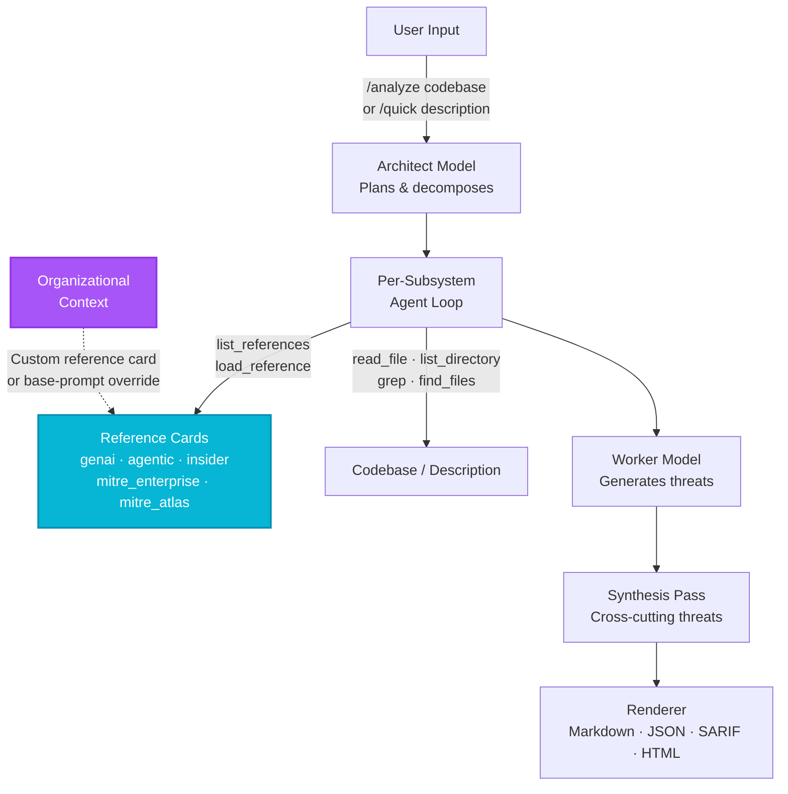
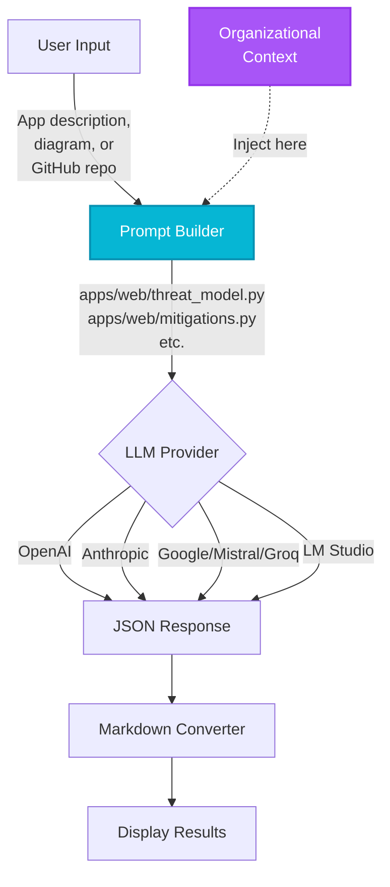
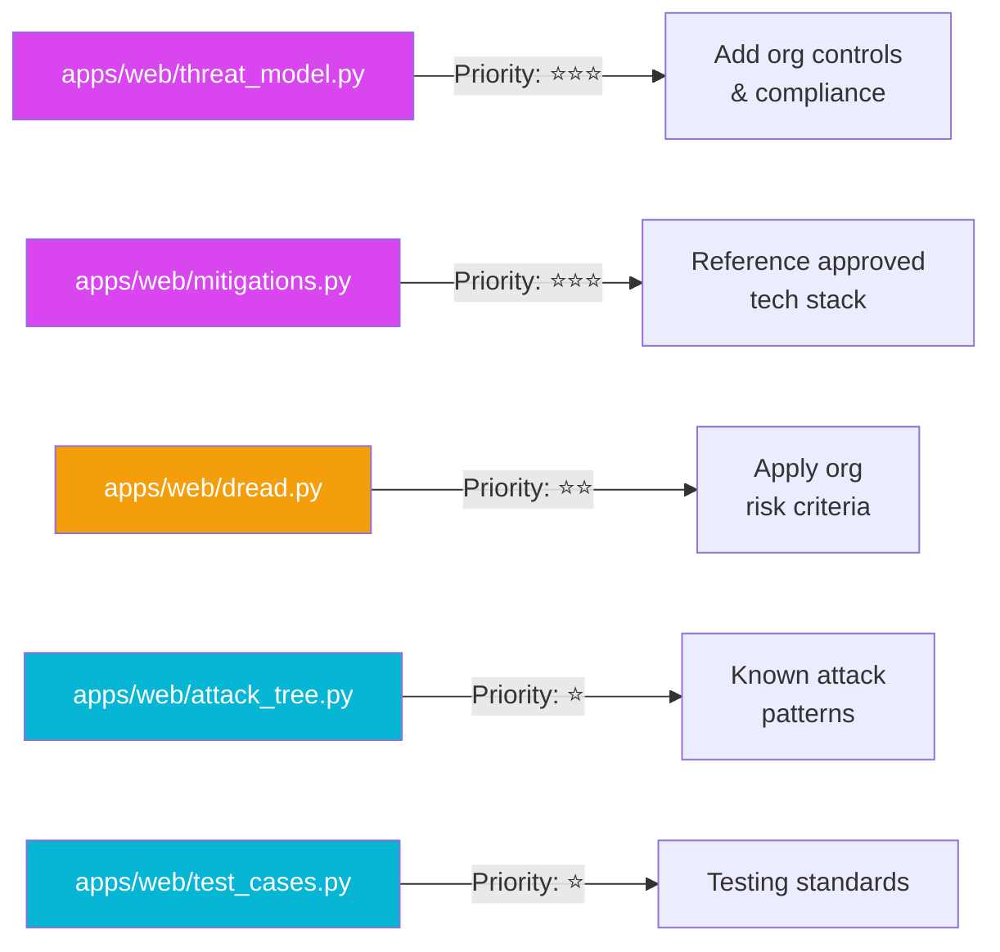
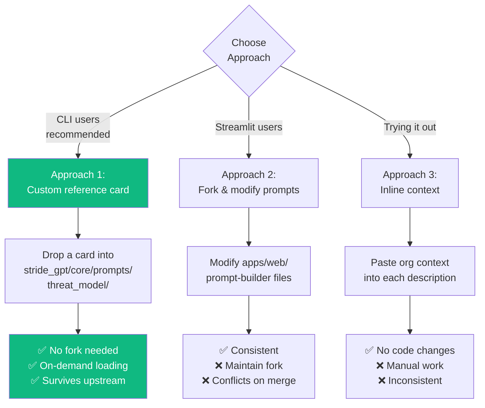
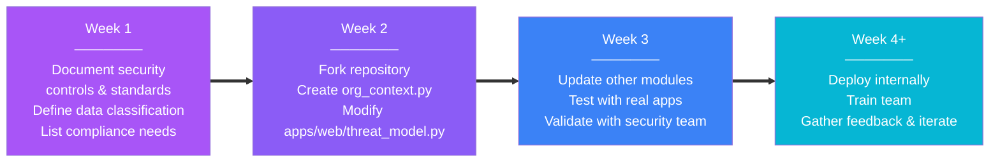
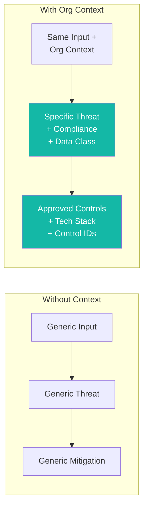
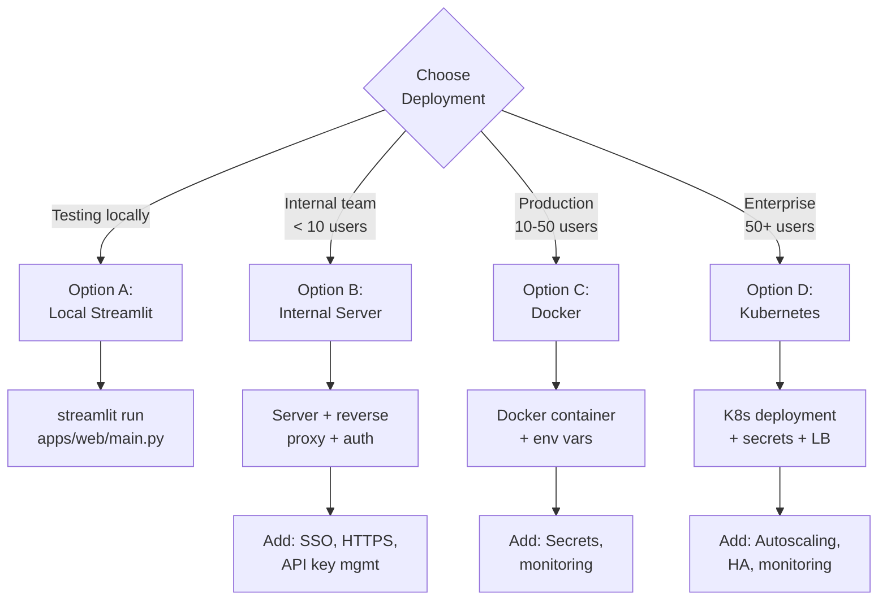
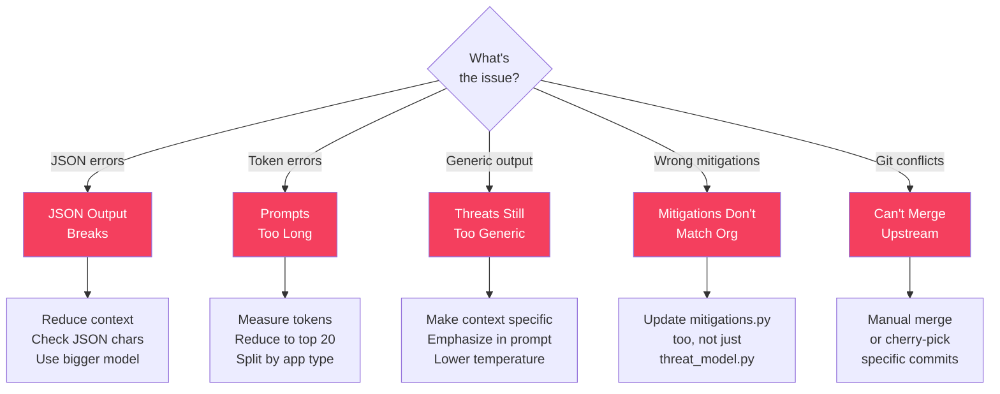

# Operationalizing STRIDE-GPT: A Practical Guide

## What This Guide Is About

STRIDE-GPT ships in two flavours:

- **Agentic CLI** (`pip install stride-gpt`) — autonomous codebase analysis, scriptable, SARIF output for CI/CD, air-gappable. Recommended for enterprise rollouts and the focus of most of this guide.
- **Legacy Streamlit web UI** (`apps/web/`) — interactive browser experience, multi-modal input (architecture diagrams), useful for ad-hoc analyst exploration.

Both paths generate threat models using LLMs; both are customizable for your organization. This guide covers both, leading with the CLI path.

**Key insight**: The quality of threat models depends on the context you provide. Generic inputs → generic threats. Organizational context → specific, actionable threats.

**Which path should you customize?**

| Need | Path |
| --- | --- |
| Codebase-aware analysis driven from source control or CI | CLI (`/analyze`) |
| One-off threat model from a written description in a terminal | CLI (`/quick`) |
| SARIF imports into GitHub / GitLab / Azure DevOps / IDEs | CLI (any command) |
| Air-gapped deployment with on-prem LLM (LM Studio) | CLI |
| Browser UI for analysts who don't live in the terminal | Streamlit |
| Architecture diagram / flowchart upload as input | Streamlit (multi-modal) |
| DREAD scoring, attack trees, Gherkin tests | Streamlit (until equivalents land in the CLI) |

---

## Understanding STRIDE-GPT's Architecture

### How the CLI Works


```mermaid
flowchart TD
    A[User Input] -->|/analyze codebase<br/>or /quick description| B[Architect Model<br/>Plans & decomposes]
    B --> C[Per-Subsystem<br/>Agent Loop]
    C -->|list_references<br/>load_reference| D[Reference Cards<br/>genai · agentic · insider<br/>mitre_enterprise · mitre_atlas]
    C -->|read_file · list_directory<br/>grep · find_files| E[Codebase / Description]
    C --> F[Worker Model<br/>Generates threats]
    F --> G[Synthesis Pass<br/>Cross-cutting threats]
    G --> H[Renderer<br/>Markdown · JSON · SARIF · HTML]

    I[Organizational<br/>Context] -.->|Custom reference card<br/>or base-prompt override| D

    style I fill:#A855F7,stroke:#9333EA,stroke-width:2px,color:#fff
    style D fill:#06B6D4,stroke:#0891B2,stroke-width:2px,color:#fff
```

**CLI customization points (in priority order):**

| Where | Priority | What it controls |
| --- | --- | --- |
| Custom reference card in `stride_gpt/core/prompts/threat_model/` | ⭐⭐⭐ | Org controls, compliance, approved tech stack — selectively loaded by the agent when triggers match |
| `base.md` / `quick_base.md` | ⭐⭐ | Always-loaded baseline (use sparingly — these go into every analysis) |
| Worker / architect model selection in config | ⭐⭐ | Cost, latency, reasoning depth |
| Custom tool in `stride_gpt/agent/tools.py` | ⭐ | Exposing internal org-specific data sources (SBOM lookup, control catalogue API, etc.) |

The reference-card system is the recommended customization surface because cards are loaded **on demand** by the agent — your org context only enters context when relevant, keeping token spend down.

### How the Streamlit Web UI Works


```mermaid
flowchart TD
    A[User Input] -->|App description,<br/>diagram, or<br/>GitHub repo| B[Prompt Builder]
    B -->|apps/web/threat_model.py<br/>apps/web/mitigations.py<br/>etc.| C{LLM Provider}
    C -->|OpenAI| D[JSON Response]
    C -->|Anthropic| D
    C -->|Google/Mistral/Groq| D
    C -->|LM Studio| D
    D --> E[Markdown Converter]
    E --> F[Display Results]

    G[Organizational<br/>Context] -.->|Inject here| B

    style G fill:#A855F7,stroke:#9333EA,stroke-width:2px,color:#fff
    style B fill:#06B6D4,stroke:#0891B2,stroke-width:2px,color:#fff
```

**Streamlit customization points:**


```mermaid
graph LR
    A[apps/web/threat_model.py] -->|Priority: ⭐⭐⭐| B[Add org controls<br/>& compliance]
    C[apps/web/mitigations.py] -->|Priority: ⭐⭐⭐| D[Reference approved<br/>tech stack]
    E[apps/web/dread.py] -->|Priority: ⭐⭐| F[Apply org<br/>risk criteria]
    G[apps/web/attack_tree.py] -->|Priority: ⭐| H[Known attack<br/>patterns]
    I[apps/web/test_cases.py] -->|Priority: ⭐| J[Testing standards]

    style A fill:#D946EF,color:#fff
    style C fill:#D946EF,color:#fff
    style E fill:#F59E0B,color:#fff
    style G fill:#06B6D4,color:#fff
    style I fill:#06B6D4,color:#fff
```

### Key Limitation
**Neither path currently ships a built-in mechanism for injecting organizational context.** The CLI lets you add a reference card without touching shipped code; the Streamlit UI requires forking and modifying prompt-builder modules.

---

## Customization Approaches


```mermaid
graph TD
    Start{Choose<br/>Approach}

    Start -->|CLI users<br/>recommended| A1[Approach 1:<br/>Custom reference card]
    Start -->|Streamlit users| A2[Approach 2:<br/>Fork & modify prompts]
    Start -->|Trying it out| A3[Approach 3:<br/>Inline context]

    A1 --> B1[Drop a card into<br/>stride_gpt/core/prompts/<br/>threat_model/]
    A2 --> B2[Modify apps/web/<br/>prompt-builder files]
    A3 --> B3[Paste org context<br/>into each description]

    B1 --> C1[✅ No fork needed<br/>✅ On-demand loading<br/>✅ Survives upstream]
    B2 --> C2[✅ Consistent<br/>❌ Maintain fork<br/>❌ Conflicts on merge]
    B3 --> C3[✅ No code changes<br/>❌ Manual work<br/>❌ Inconsistent]

    style A1 fill:#10B981,color:#fff
    style C1 fill:#10B981,color:#fff
```

### Approach 1: Custom reference card (Recommended for CLI)

Add a new `.md` file alongside the shipped cards (`genai`, `agentic`, `insider_threat`, `mitre_enterprise`, `mitre_atlas`). The agent discovers it through `list_references` and loads it via `load_reference` only when its `when_to_load` trigger matches the subsystem under analysis. No fork required if you maintain it as a deployment overlay; minimal-touch fork if you commit it back into your internal mirror.

**Pros:** On-demand loading keeps token spend down, survives upstream updates cleanly, additive (no shipped code modified), discoverable by the agent automatically.
**Cons:** CLI-only, doesn't apply to the Streamlit UI.

### Approach 2: Fork and modify prompt builders (Streamlit UI)

Modify the prompt-builder modules under `apps/web/` to inject organizational context into each prompt template. This is the legacy pattern and still works for Streamlit users.

**Pros:** Consistent context across all Streamlit features (threats, mitigations, attack trees, DREAD, test cases), one-time setup.
**Cons:** Requires code changes, ongoing maintenance to merge upstream updates, conflicts likely on every refresh.

### Approach 3: Inline context (Quickest)

Manually add organizational context to your application descriptions or `/quick` inputs.

**Example Input:**
```
Application: Customer portal web application

Architecture: Three-tier web app on AWS
- Frontend: React (hosted on CloudFront)
- Backend: Python FastAPI (ECS Fargate)
- Database: RDS PostgreSQL

Organizational Context:
- We use Okta SSO (all apps must use it)
- Data classification: PII (Customer names, emails)
- Compliance: SOC2 Type II required
- Approved controls: WAF (AWS WAF), encryption at rest (RDS encryption)
```

**Pros:** No code changes, works immediately on either path.
**Cons:** Manual work for each threat model, easy to forget controls, inconsistent across analysts.

---

## Quick Start: Custom Reference Card (CLI)

### Prerequisites
- Python 3.12+ installed
- `pip install stride-gpt` (or an editable install from a fork if you want to commit cards back to source)
- An API key for at least one LLM provider, or a running LM Studio endpoint

### Step 1: Identify Your Card's Trigger

Cards self-describe via YAML frontmatter. The agent reads each card's `when_to_load` clause from `list_references` and decides whether to call `load_reference` based on the subsystem under analysis.

Think about when your org-context card should fire. Some examples:

- **Always** (anything analysed at your org) — broad trigger like "load for every subsystem"
- **AWS deployments only** — trigger mentions ECS, Lambda, EC2, RDS, S3, etc.
- **Payment processing** — trigger mentions Stripe, PCI scope, card data
- **Internal-facing services** — trigger mentions internal subnets or auth-via-SSO

Narrow triggers keep token cost down; broad triggers ensure coverage.

### Step 2: Draft the Card

Create a new file at `stride_gpt/core/prompts/threat_model/myorg.md` (or wherever your install resolves the prompts directory — see `stride_gpt/core/prompts/threat_model/__init__.py`):

```markdown
---
name: myorg
title: MyOrg Security Standards
when_to_load: |
  Load for every subsystem analysed at MyOrg — these are
  baseline security controls and compliance requirements that
  apply to all internal applications regardless of stack.
adds_fields:
  - MYORG_CONTROL
stride_letters: [S, T, R, I, D, E]
source: internal://security-standards/v3.2
version: 2026.05
---

# MyOrg Security Standards — Reference Card

You loaded this card because the subsystem you are analysing is
deployed at MyOrg. Apply MyOrg's standard controls and compliance
requirements when generating threats and mitigations.

## Approved controls (cite by ID)

- **AUTH-001** — Okta SSO with MFA mandatory for all production access
- **ENC-001** — AES-256 at rest, TLS 1.3 in transit
- **NET-001** — Private subnets only; no direct internet ingress without WAF
- **MON-001** — All API calls logged to CloudWatch with 90-day retention

## Approved tech stack

Languages: Python 3.12+, TypeScript, Go
Cloud: AWS only (us-east-1, eu-west-1)
Datastores: RDS PostgreSQL, DynamoDB, S3 (with default encryption)
Auth: Okta SSO + AWS IAM (no static credentials)

## Compliance scope

- SOC2 Type II for all production systems
- PCI DSS v4.0 for payment processing systems
- GDPR Article 32 for EU customer data

## Anti-pattern to flag

Threats that suggest mitigations using technologies not on the
approved stack should be flagged as `MYORG_CONTROL_GAP` and call
out which approved control would satisfy the requirement instead.

## Schema additions

Each threat object may include:

- `"MYORG_CONTROL"`: the approved control ID that mitigates this
  threat (e.g. `"AUTH-001"`), or `null` if no approved control
  fits cleanly.
```

Use the existing `mitre_enterprise.md` or `insider_threat.md` as a structural template — the frontmatter shape and "Anti-hallucination requirement" pattern (where applicable) are worth copying.

### Step 3: Verify the Agent Picks It Up

```bash
stride-gpt /quick -i some_description.txt -f json -o /tmp/test.json
```

In the output's `metadata.tools_used` block, you should see `load_reference` invoked with `name: myorg`. If it isn't, the trigger isn't matching — broaden the `when_to_load` language or add explicit examples of the subsystem types that should pull the card.

### Step 4: Test the Output

Confirm the generated threats reference your approved controls by name and your compliance scope when relevant. If they don't:
- The card body may be too implicit — add a "How to use this card" section with explicit instructions, mirroring the shipped cards
- The worker model may be too small — try escalating to a larger worker temporarily to confirm the card content is the bottleneck

### Step 5: Token Budget

Reference cards are loaded **per-subsystem**, so a 5k-token card analysed across 8 subsystems costs ~40k tokens in worker calls. Best practices:

- Keep cards under 5k tokens each; split big cards by trigger (e.g. `myorg_baseline`, `myorg_payments`, `myorg_pii`)
- Use narrow `when_to_load` triggers so cards only load when relevant
- The architect doesn't see card bodies — only `list_references` metadata — so card count is cheap; card *body size* is what matters

---

## Quick Start: Fork and Customize (Streamlit UI)

### Implementation Roadmap


```mermaid
graph LR
    W1[Week 1<br/>───────<br/>Document security<br/>controls & standards<br/>Define data classification<br/>List compliance needs]
    W2[Week 2<br/>───────<br/>Fork repository<br/>Create org_context.py<br/>Modify apps/web/threat_model.py]
    W3[Week 3<br/>───────<br/>Update other modules<br/>Test with real apps<br/>Validate with security team]
    W4[Week 4+<br/>───────<br/>Deploy internally<br/>Train team<br/>Gather feedback & iterate]

    W1 ==> W2 ==> W3 ==> W4

    style W1 fill:#A855F7,color:#fff
    style W2 fill:#8B5CF6,color:#fff
    style W3 fill:#3B82F6,color:#fff
    style W4 fill:#06B6D4,color:#fff
```

### Prerequisites
- Basic Python knowledge
- Git installed
- Python 3.12+ installed

### Step 1: Fork the Repository
```bash
git clone https://github.com/mrwadams/stride-gpt.git my-org-stride-gpt
cd my-org-stride-gpt
```

### Step 2: Create Your Organizational Context

Create a new file `apps/web/org_context.py` that contains:
- **Approved security controls** (authentication, encryption, network, monitoring)
- **Technology stack** (approved languages, frameworks, cloud platforms)
- **Compliance requirements** (SOC2, GDPR, PCI-DSS, etc.)
- **Data classification levels** (Public, Internal, Confidential, Restricted)
- **Standard architectures** (your typical web app, mobile app, API patterns)

**Important:** Start small. Add your top 10-20 controls, 1-2 architectures, and key compliance requirements. You can expand later.

<details>
<summary>Example: org_context.py structure (click to expand)</summary>

The file should define your security context as a text string including:
- Authentication requirements (e.g., "Okta SSO with MFA mandatory")
- Encryption standards (e.g., "AES-256 at rest, TLS 1.3 in transit")
- Approved tech stack (e.g., "Python 3.9+, React, PostgreSQL, AWS only")
- Compliance frameworks (e.g., "SOC2 Type II for all production")
- Reference architectures (e.g., "CloudFront → ALB → ECS → RDS")
</details>

### Step 3: Modify the Threat Model Prompt

Open `stride_gpt/core/prompts/builder.py` and find the `create_threat_model_prompt` function. (The web UI re-exports it from `apps/web/threat_model.py`, but the prompt body now lives in the shared core builder — so this one change affects both the Streamlit UI and any code path that builds the single-shot prompt.)

**Key changes needed:**
1. Import your organizational context: `from apps.web.org_context import get_org_context`
2. Inject the context into the prompt before the main instructions
3. Add guidance to the LLM to reference your specific controls, tech stack, and compliance requirements

This ensures every threat model generated will be tailored to your organization's standards.

<details>
<summary>Technical implementation details (click to expand)</summary>

The modification involves adding your org context to the prompt template and instructing the LLM to:
- Reference approved security controls by name
- Only suggest mitigations using your approved tech stack
- Consider your specific compliance requirements
- Apply your data classification levels when assessing impact
- Flag technologies not in your approved stack
- Identify gaps where standard controls aren't implemented
</details>

### Step 4: Update Other Modules (Optional but Recommended)

Apply the same pattern to other modules under `apps/web/`:
- **`mitigations.py`** - Ensures suggested mitigations use your approved tech stack
- **`attack_tree.py`** - Incorporates known attack patterns from your environment
- **`dread.py`** - Applies your organization's risk scoring criteria
- **`test_cases.py`** - References your testing standards and frameworks

Each follows the same pattern: import the context, inject it into the prompt, and guide the LLM to use your organization's standards.

### Step 5: Test Your Changes

```bash
# Install dependencies (if not already done)
uv sync

# Run locally
streamlit run apps/web/main.py
```

**Test checklist:**
1. Generate a threat model for a test application
2. Verify threats reference your security controls
3. Verify mitigations suggest your approved technologies
4. Check that compliance requirements are mentioned
5. Confirm data classification levels are applied correctly
6. Ensure JSON output is still valid (not broken by context injection)

### Step 6: Handle Token Limits

Large organizational context can consume tokens. Best practices:
- **Monitor context size** - Keep organizational context under 10-20k tokens
- **Start focused** - Include only your top 20 controls and 2-3 reference architectures
- **Optimize over time** - Add more detail based on actual usage patterns
- **Conditional loading** - Load different context based on application type (web, mobile, API)

Modern LLMs (GPT-5.2, Claude Sonnet 4.5, Gemini 3) have 200k–1M token context windows, so most organizational contexts fit comfortably.

---

## Before/After Example

### Impact of Organizational Context


```mermaid
graph LR
    subgraph "Without Context"
    A1[Generic Input] --> B1[Generic Threat]
    B1 --> C1[Generic Mitigation]
    end

    subgraph "With Org Context"
    A2[Same Input +<br/>Org Context] --> B2[Specific Threat<br/>+ Compliance<br/>+ Data Class]
    B2 --> C2[Approved Controls<br/>+ Tech Stack<br/>+ Control IDs]
    end

    style B2 fill:#14B8A6,color:#fff
    style C2 fill:#14B8A6,color:#fff
```

### Without Organizational Context

**Generated Threat:**
```
Threat Type: Information Disclosure
Scenario: Sensitive data could be exposed if the database is compromised
Potential Impact: Data breach exposing user information
```

**Generated Mitigation:**
```
- Implement database encryption
- Use access controls
- Enable audit logging
```

### With Organizational Context

**Generated Threat:**
```
Threat Type: Information Disclosure
Scenario: Customer PII (Confidential data classification) in RDS PostgreSQL could be exposed if database encryption at rest is not enabled, violating SOC2 CC6.6 requirements
Potential Impact: Data breach exposing Confidential customer data, SOC2 compliance violation, potential GDPR Article 32 breach for EU customers
```

**Generated Mitigation:**
```
- Enable RDS encryption at rest using AWS KMS (approved control: Data-001)
- Verify VPC isolation is configured per standard architecture (no direct internet access)
- Implement database access logging to CloudWatch (approved monitoring: Monitor-001)
- Ensure Okta SSO authentication is enforced for database admin access (approved control: Auth-001)
```

**Key improvements:**
- ✅ Specific data classification referenced
- ✅ Compliance frameworks cited
- ✅ Approved controls referenced by ID/name
- ✅ Matches organizational architecture standards

---

## Deployment Options

### CLI Deployment

#### Option 1: pip install (Simplest)

```bash
pip install stride-gpt
stride-gpt /analyze ./my-codebase -o threat-model.html -f html
stride-gpt /quick -i app-description.txt -f sarif -o threats.sarif
```

Install into a per-user venv on shared workstations, into a base image for build agents, or into a project-local `uv` environment for repo-specific use. No daemon, no port, no surface to defend — just a Python entrypoint.

#### Option 2: CI/CD Integration (SARIF)

The CLI emits SARIF 2.1.0 with `-f sarif`, which most CI platforms can ingest and surface as code-scanning findings. Each threat becomes a SARIF result; STRIDE category sits in `properties.stride`, OWASP / insider / MITRE mappings are carried as additional properties.

**GitHub Actions example:**

```yaml
name: Threat Model
on: [pull_request]
jobs:
  threat-model:
    runs-on: ubuntu-latest
    permissions:
      security-events: write
    steps:
      - uses: actions/checkout@v4
      - uses: astral-sh/setup-uv@v3
      - run: uv tool install stride-gpt
      - name: Generate threat model
        env:
          ANTHROPIC_API_KEY: ${{ secrets.ANTHROPIC_API_KEY }}
        run: stride-gpt /analyze . -o threats.sarif -f sarif
      - name: Upload SARIF
        uses: github/codeql-action/upload-sarif@v3
        with:
          sarif_file: threats.sarif
```

This surfaces threats in the **Security → Code scanning** tab of the repo and on PR diff views. Cost-control tip: gate the workflow on `paths-filter` so it only runs when affected subsystems change, and use a smaller `worker_model` for incremental analyses.

GitLab, Azure DevOps, and Bitbucket all support SARIF ingestion via similar steps — the upload mechanics differ but the SARIF file is the same.

#### Option 3: Air-Gapped / On-Prem LLM

For organizations that can't send code or descriptions to a third-party API, run the CLI against a local LM Studio (or any OpenAI-compatible) endpoint:

```bash
# Set up LM Studio with a capable model (Llama 3.3 70B Instruct, Qwen 2.5 Coder 32B,
# DeepSeek R1 distill, etc.) and start the server on localhost:1234

export LMSTUDIO_BASE_URL=http://lmstudio.internal:1234/v1
stride-gpt /config  # select LM Studio as the provider
stride-gpt /analyze ./my-codebase
```

Notes for air-gapped deployments:
- Reference-card refresh (`scripts/refresh_mitre_cards.py`) pulls from `mitre/cti` and `mitre-atlas/atlas-data` — run it on a connected build host, then ship the regenerated cards in your internal mirror
- Tool-using agents benefit from large-context models; under-resourced local models will produce thinner threat models than frontier APIs
- The CLI never writes to network sockets other than the configured LLM endpoint — straightforward to audit

### Streamlit UI Deployment


```mermaid
graph TD
    Start{Choose<br/>Deployment}

    Start -->|Testing locally| D1[Option A:<br/>Local Streamlit]
    Start -->|Internal team<br/>< 10 users| D2[Option B:<br/>Internal Server]
    Start -->|Production<br/>10-50 users| D3[Option C:<br/>Docker]
    Start -->|Enterprise<br/>50+ users| D4[Option D:<br/>Kubernetes]

    D1 --> E1[streamlit run<br/>apps/web/main.py]
    D2 --> E2[Server + reverse<br/>proxy + auth]
    D3 --> E3[Docker container<br/>+ env vars]
    D4 --> E4[K8s deployment<br/>+ secrets + LB]

    E2 --> F2[Add: SSO, HTTPS,<br/>API key mgmt]
    E3 --> F3[Add: Secrets,<br/>monitoring]
    E4 --> F4[Add: Autoscaling,<br/>HA, monitoring]
```

#### Option A: Run Locally
```bash
streamlit run apps/web/main.py --server.port 8501
```

#### Option B: Internal Server Deployment
```bash
# On your internal server
streamlit run apps/web/main.py --server.port 8501 --server.address 0.0.0.0
```

**Security considerations:**
- Put behind authentication (SSO, VPN)
- Use HTTPS (reverse proxy with nginx/Apache)
- Store API keys in environment variables, not in code
- The embedded draw.io diagram editor loads from the hosted `embed.diagrams.net` by default, i.e. outbound egress from each analyst's browser. For air-gapped or egress-restricted environments, self-host draw.io and set `STRIDE_GPT_DRAWIO_URL` to its host so no diagram traffic leaves your network

#### Option C: Docker Deployment

The project includes `Dockerfile.ui` for the Streamlit web UI. Build your customized version:

```bash
docker build -f Dockerfile.ui -t myorg-stride-gpt .
```

The published image lives at `mrwadams/stridegpt:latest` (multi-arch, linux/amd64 + linux/arm64). For the CLI, install from PyPI with `pip install stride-gpt` — there's no CLI Docker image.

**Local development/testing:**
```bash
# Use .env file for local testing only
docker run -p 8501:8501 --env-file .env myorg-stride-gpt
```

**Production deployment:**

⚠️ **Never use `.env` files in production.** Use proper secrets management:

**Option A: Docker Swarm Secrets**
```bash
echo "sk-..." | docker secret create openai_api_key -
docker service create \
  --secret openai_api_key \
  --publish 8501:8501 \
  myorg-stride-gpt
```

**Option B: Environment variables from secure source**
```bash
# Pass from AWS Secrets Manager, HashiCorp Vault, etc.
docker run -p 8501:8501 \
  -e OPENAI_API_KEY=$(aws secretsmanager get-secret-value --secret-id prod/stride-gpt/openai --query SecretString --output text) \
  myorg-stride-gpt
```

**API Keys needed:**
- LLM provider keys (OpenAI, Anthropic, Google, etc.)
- Optional: GitHub token for repository analysis
- Optional: LM Studio endpoint for local models

#### Option D: Kubernetes (Enterprise)

For organizations running Kubernetes:
- Deploy as a standard containerized application
- Store API keys as Kubernetes secrets
- Configure resource limits (typically 512Mi-1Gi memory)
- Use load balancer for high availability
- Enable autoscaling based on usage

Your DevOps team can use standard Kubernetes deployment patterns with the STRIDE-GPT Docker image.

---

## Maintenance and Updates

### Keeping Up with Upstream Changes

```bash
# Add upstream remote (one time)
git remote add upstream https://github.com/mrwadams/stride-gpt.git

# Fetch latest changes
git fetch upstream

# View what changed
git log HEAD..upstream/main --oneline

# Merge updates (be careful - may conflict with your modifications)
git merge upstream/main
```

**When conflicts occur (Streamlit fork only):**
- Your `apps/web/org_context.py` won't conflict (it's new)
- Prompt modifications in `apps/web/threat_model.py` etc. will likely conflict
- Manually resolve by preserving both upstream improvements and your org context injection

For CLI custom reference cards, conflicts are rare — your `myorg.md` lives alongside shipped cards but isn't touched by upstream.

### Version Control Your Organizational Context

Treat your `org_context.py` like any other critical configuration:
- Include version numbers and last updated dates
- Maintain a changelog of what controls were added/modified
- Review and update quarterly
- Track who made changes and why

### Regular Updates to Consider

**Quarterly:**
- Review and update security controls
- Add newly approved technologies
- Update compliance requirements
- Incorporate lessons learned from threat models

**When needed:**
- After security incidents (add new threat patterns)
- When new compliance requirements emerge
- After technology stack changes
- When new reference architectures are approved

---

## Troubleshooting


```mermaid
flowchart TD
    Problem{What's<br/>the issue?}

    Problem -->|JSON errors| P1[JSON Output<br/>Breaks]
    Problem -->|Token errors| P2[Prompts<br/>Too Long]
    Problem -->|Generic output| P3[Threats Still<br/>Too Generic]
    Problem -->|Wrong mitigations| P4[Mitigations Don't<br/>Match Org]
    Problem -->|Git conflicts| P5[Can't Merge<br/>Upstream]

    P1 --> S1[Reduce context<br/>Check JSON chars<br/>Use bigger model]
    P2 --> S2[Measure tokens<br/>Reduce to top 20<br/>Split by app type]
    P3 --> S3[Make context specific<br/>Emphasize in prompt<br/>Lower temperature]
    P4 --> S4[Update mitigations.py<br/>too, not just<br/>threat_model.py]
    P5 --> S5[Manual merge<br/>or cherry-pick<br/>specific commits]

    style P1 fill:#F43F5E,color:#fff
    style P2 fill:#F43F5E,color:#fff
    style P3 fill:#F43F5E,color:#fff
    style P4 fill:#F43F5E,color:#fff
    style P5 fill:#F43F5E,color:#fff
```

### Problem: JSON Output Breaks After Adding Context

**Symptom:** Error parsing JSON response from LLM

**Cause:** Context too large, confusing the model, or breaking token limits

**Solutions:**
1. Reduce context size - keep only essential information
2. Use a model with larger context window (GPT-4, Claude Opus)
3. Test with simpler app descriptions first
4. Check that your context doesn't include unescaped JSON characters

### Problem: Prompts Too Long / Token Limit Errors

**Symptom:** API errors about token limits

**Solutions:**
1. Measure your context size using token counting tools
2. If too large (>10k tokens for context alone):
   - Reduce to top 20 controls
   - Remove verbose descriptions
   - Use abbreviations
   - Split into conditional loading based on app type

### Problem: Threats Still Too Generic

**Symptom:** Organizational context doesn't seem to affect outputs

**Causes & Solutions:**
1. **Context not in the right place in prompt:**
   - Make sure it's before the IMPORTANT instructions
   - Emphasize in the instructions to use the context

2. **Context too vague:**
   - Be specific: "Okta SSO with MFA" not "SSO"
   - Include implementation details
   - Provide exact technology versions

3. **Model temperature too high:**
   - In the get_threat_model() calls, reduce temperature to 0.3-0.5

### Problem: Mitigations Don't Match Org Controls (Streamlit fork)

**Symptom:** Suggested mitigations ignore organizational standards

**Cause:** Only updated `apps/web/threat_model.py`, not `apps/web/mitigations.py`

**Solution:** Update the `create_mitigations_prompt` function in `apps/web/mitigations.py` to also inject organizational context (see Step 4 above). For CLI users this problem doesn't apply — a single reference card covers all generation phases.

### Problem: Can't Merge Upstream Updates

**Symptom:** Git conflicts in modified files

**Solution:**
```bash
# Option 1: Manual merge
git merge upstream/main
# Fix conflicts in threat_model.py, mitigations.py, etc.
# Keep both upstream improvements and your org context injection
git add .
git commit -m "Merged upstream updates, preserved org customizations"

# Option 2: Cherry-pick specific updates
git log upstream/main --oneline
git cherry-pick <commit-hash>  # Pick specific improvements
```

---

## Common Customizations

### 1. Environment-Based Context Loading
Load different security contexts for dev/staging/prod environments. Production requires all controls, while development can have relaxed requirements for testing.

### 2. Application Type-Specific Context
Customize context based on application type (web, mobile, API). Each type has specific security controls relevant to it (e.g., WAF for web apps, certificate pinning for mobile).

### 3. Conditional Loading
Load only relevant portions of your context based on application characteristics to manage token usage efficiently.

---

## Measuring Success

Consider tracking:

| Metric | How to Measure |
|--------|---------------|
| **Threat model quality** | % of threats validated by security team as accurate |
| **Time savings** | Time to generate model vs. manual process |
| **Adoption** | Number of threat models generated per month |
| **Coverage** | % of applications with threat models |
| **Context effectiveness** | % of threats that reference org controls |

### Simple Usage Tracking

Consider adding basic logging to track:
- Number of threat models generated per month
- Which LLM providers are being used
- Average threats identified per model
- Which teams/applications are using the tool

This data helps demonstrate ROI and identify opportunities for improvement.

---

## Alternative: Wrapper Script Approach

If you don't want to modify STRIDE-GPT code, you can create a simple script that:
1. Takes your application description as input
2. Automatically prepends your organizational context
3. Outputs the combined text to paste into STRIDE-GPT

**Pros:** No STRIDE-GPT code changes, easier to maintain
**Cons:** Manual copy-paste step, not integrated into the UI

This is useful for quick pilots or when you can't deploy a modified version.

---

## Next Steps

### Week 1: Prepare Your Context
1. Document your top 10-20 security controls
2. Identify 1-2 standard reference architectures
3. List compliance requirements (SOC2, GDPR, etc.)
4. Define your data classification scheme
5. Draft this as either a CLI reference card body (`myorg.md`) or a Streamlit `apps/web/org_context.py` string

### Week 2: Implement and Test
**CLI path:**
1. `pip install stride-gpt` on a test box
2. Drop your `myorg.md` into `stride_gpt/core/prompts/threat_model/` (or your overlay)
3. Run `stride-gpt /quick` on 3-5 representative applications
4. Confirm the agent loads the card and threats cite your controls
5. Validate output with your security team

**Streamlit path:**
1. Fork the STRIDE-GPT repository
2. Add organizational context injection to `apps/web/threat_model.py`
3. Test with 3-5 real applications from your organization
4. Compare outputs with and without context
5. Validate threats with your security team

### Week 3: Expand and Deploy
**CLI path:**
1. Add a CI/CD workflow that runs `stride-gpt /analyze . -f sarif` on pull requests
2. Wire SARIF upload to GitHub/GitLab/Azure DevOps code scanning
3. (Optional) Stand up an LM Studio endpoint for air-gapped use
4. Document the workflow for engineering teams

**Streamlit path:**
1. Update `apps/web/mitigations.py`, `apps/web/dread.py`, and other modules
2. Set up internal deployment (Docker/K8s)
3. Configure authentication and API key management
4. Create user documentation for your team

### Week 4+: Scale and Iterate
1. Train security champions on the tool
2. Gather feedback on threat model quality
3. Refine organizational context based on learnings
4. Expand CI/CD coverage to additional repos (CLI path)
5. Track metrics and measure impact

---

## FAQs

### Q: Can I use this with local/private LLMs?
**A:** Yes — both paths support LM Studio (or any OpenAI-compatible endpoint) for on-premises deployment, useful for organizations with data privacy requirements. CLI: run `stride-gpt /config` and pick LM Studio as the provider; or set `LMSTUDIO_BASE_URL` directly. Streamlit UI: select "LM Studio" from the provider dropdown. See [Option 3: Air-Gapped / On-Prem LLM](#option-3-air-gapped--on-prem-llm) above for the CLI flow.

### Q: How much context is too much?
**A:** Monitor token usage. Current model context windows (2025):
- **GPT-5**: 272k input tokens (400k total)
- **Claude Sonnet 4.5**: 200k tokens (1M with extended context)
- **GPT-4o**: 128k tokens
- Local models (LM Studio): Typically 4-32k tokens

For organizational context, aim for 10-20k tokens (20-30 controls + 2-3 architectures). This leaves room for application descriptions and responses while staying well within modern model limits.

### Q: Should I use RAG to store organizational docs?
**A:** Probably not necessary. Modern LLMs have 100k-200k token context windows. For most organizations, your security controls, architectures, and compliance requirements fit comfortably in 5-10k tokens. Just include them directly in the prompt. RAG adds complexity without clear benefits for this use case.

### Q: How do I keep my fork synchronized with upstream?
**A:** (Streamlit fork only — CLI users with custom reference cards don't need to fork.)
```bash
git remote add upstream https://github.com/mrwadams/stride-gpt.git
git fetch upstream
git merge upstream/main
```
Be careful with merge conflicts in files you've modified (`apps/web/threat_model.py`, etc.). Manually resolve to keep both upstream improvements and your customizations.

### Q: Will this work with reasoning models (OpenAI o1, etc.)?
**A:** Yes, STRIDE-GPT supports reasoning models. They already handle context well, so organizational context injection works the same way. Note that reasoning models use more tokens, so monitor your context size.

### Q: Can I automate threat model generation in CI/CD?
**A:** Yes — that's the CLI's primary use case. `stride-gpt /analyze . -o threats.sarif -f sarif` produces SARIF 2.1.0, which GitHub, GitLab, Azure DevOps, and Bitbucket all ingest as code-scanning findings. See the [CI/CD Integration](#option-2-cicd-integration-sarif) section above for a GitHub Actions example. Cost-wise, gate the workflow on path filters (only re-run when affected subsystems change) and use a smaller `worker_model` for incremental analyses.

### Q: Should I prefer the CLI or the Streamlit UI for my organization?
**A:** Default to the CLI. It scripts cleanly, integrates with CI/CD via SARIF, supports air-gapped LLMs, and has a cleaner customization surface (drop-in reference cards rather than forking prompt files). The Streamlit UI is the better choice when analysts need a browser experience, want to upload architecture diagrams as input, or use features that haven't been ported to the CLI yet (DREAD scoring, attack trees, Gherkin test cases). Both paths can coexist — many orgs run the CLI in CI and the Streamlit UI internally for analyst sessions.

### Q: How do I keep custom reference cards in sync with upstream?
**A:** Cards are additive — your `myorg.md` lives next to the shipped cards but isn't touched by upstream updates. Two patterns work:

- **Overlay**: Keep `myorg.md` in a separate repo and copy it into the install at deploy time (`cp myorg.md $(python -c 'import stride_gpt.core.prompts.threat_model as m; print(m.__path__[0])')`). Zero merge conflicts; no fork required.
- **Internal fork**: Mirror the repo internally, commit your card alongside shipped ones. Rebase against upstream periodically — your card never touches upstream files so conflicts are rare.

Either way, `list_references` discovers cards by filename, so adding one is genuinely a single-file change.

### Q: What if my organization uses GitHub Enterprise?
**A:** STRIDE-GPT already supports GitHub Enterprise (added in v0.14). Just provide your GitHub Enterprise URL and it will automatically detect and use the correct API endpoint.

### Q: How do I handle multiple compliance frameworks?
**A:** Include all applicable frameworks in your organizational context. You can conditionally load specific requirements based on the application's data classification or type. For example, GDPR applies when handling EU customer data, PCI-DSS for payment processing, HIPAA for healthcare data, etc.

---

## Resources

- **STRIDE-GPT Repository:** https://github.com/mrwadams/stride-gpt
- **PyPI:** `pip install stride-gpt` — https://pypi.org/project/stride-gpt/
- **Issues & Questions:** [GitHub Issues](https://github.com/mrwadams/stride-gpt/issues)
- **Docker Image (Streamlit UI):** `mrwadams/stridegpt:latest` — multi-arch (linux/amd64 + linux/arm64)
- **MITRE ATT&CK Enterprise:** https://attack.mitre.org/matrices/enterprise/ — source for the `mitre_enterprise` reference card
- **MITRE ATLAS:** https://atlas.mitre.org/matrices/ATLAS — source for the `mitre_atlas` reference card
- **OWASP Top 10 for LLM Applications:** https://genai.owasp.org/llm-top-10/ — source for the `genai` reference card
- **OWASP Top 10 for Agentic Applications:** https://genai.owasp.org/resource/agentic-ai-red-teaming-guide/ — source for the `agentic` reference card
- **Documentation:** See the README for general usage; this guide focuses on customization

## Contributing Back

If you develop useful organizational patterns or improvements:

1. **Share anonymized patterns** - Open an issue describing your approach (without sensitive details)
2. **Contribute code** - Submit PRs for general improvements
3. **Help others** - Answer questions in GitHub Discussions
4. **Document lessons learned** - Share what worked and what didn't

Example contribution:
```
Title: Pattern for multi-environment context loading

Description: We implemented environment-specific context (dev/staging/prod)
using environment variables. Code pattern attached. Helped us maintain different
control requirements across environments while using the same codebase.

Benefits:
- Single codebase for all environments
- Easy context switching via env vars
- Reduced false positives in dev/staging

[Code example...]
```

---

## Conclusion

Operationalizing STRIDE-GPT for your organization primarily involves:

1. **Creating organizational context** - Document your controls, architectures, compliance requirements
2. **Injecting that context** - Either as a custom reference card under `stride_gpt/core/prompts/threat_model/` (CLI path, recommended) or by modifying the prompt-builder modules under `apps/web/` (Streamlit path)
3. **Deploying** - `pip install stride-gpt` for the CLI, Docker/Kubernetes for the Streamlit UI, both with proper secrets management
4. **Iterating based on feedback** - Refine context as you learn what works

Start small, test thoroughly, and expand based on results. The goal is threat models that are specific to your environment, reference your controls, and provide actionable guidance to your development teams.
